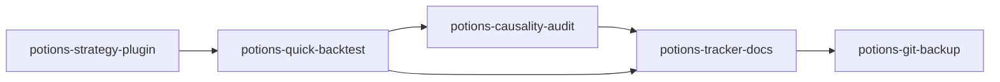

# Tracker + logs + Platform sync

## What each file is for

| File | Role | Update when |
|------|------|-------------|
| [`mnq/case_studies/STRATEGY_TRACKER.md`](../../../mnq/case_studies/STRATEGY_TRACKER.md) | Canonical rankings / promotion stance | Material research, promotion, demotion, new sleeve |
| [`live/CHANGE_LOG.md`](../../../live/CHANGE_LOG.md) | Dated runtime/research changes | Realism, demos, causality, Monday OR, platform fixes |
| [`live/PROGRESS.log`](../../../live/PROGRESS.log) | Append-only platform/research session milestones | End of a research session / major step |
| `live/state/<slug>/SUMMARY.md` (or `INDEX.md` / `RESEARCH.md`) | Study hub evidence | After regenerating that study |
| `live/state/<slug>/PROGRESS.md` or `PROGRESS.log` | Long-sweep step checklist | During multi-day sweeps |
| [`live/Platform.md`](../../../live/Platform.md) | Platform machinery reference | **Same PR** as fill/causality/metrics/plugin-contract code |
| `live/demo/<run>/PROGRESS.log` | Daemon heartbeats | **Do not** use for research writeups — see `potions-demo-status` |

## Minimal sync after a promotion-relevant backtest

1. Study hub `SUMMARY.md` (+ charts/index links)
2. `STRATEGY_TRACKER.md` section/table + stance sentence
3. Dated bullet in `CHANGE_LOG.md`
4. Short append to `live/PROGRESS.log`
5. If engine/broker/guard/metrics/plugin contract changed → Platform.md (+ `CAUSAL_GRAPH.md` if Tier-1)
6. Causality pass/fail row → `data/docs/AUDIT_TRACKER.md` (`potions-causality-audit`)

Example pattern already used: Monday OR Phase hubs list “tracker + family docs + CHANGE_LOG” as a closing step.

## Relation to other skills

- Rankings stay in the **tracker**, not in skills.
- Large regenerable artifacts → Drive/pack (`potions-git-backup`), not git.
- Demo heartbeats ≠ research PROGRESS.

## Platform.md rule (do not skip)

Any change to **fill semantics, causality guards, or reported metrics** must update [`live/Platform.md`](../../../live/Platform.md) in the **same** change set. Extension checklist for new plugins: Platform §13.

## Related skills

- `potions-repo-router` — which hub to open first
- `potions-quick-backtest` / `potions-causality-audit` — produce evidence before writing
- `potions-git-backup` — commit docs when user asks; keep dumps offline
- `potions-demo-status` — live runners, not tracker edits
