# Potions Live Platform — External Scrutiny Reference

**Version:** 0.4.1  
**Date:** 2026-08-08  
**Audience:** External quants, developers, allocator diligence reviewers  
**Scope:** Platform machinery only — not strategy rule definitions. Promotion status, rule-family names, and proprietary signal definitions are intentionally kept in internal research trackers. For validation design see [`live/specs/CAUSAL_VALIDATION_MASTER_SPEC.md`](specs/CAUSAL_VALIDATION_MASTER_SPEC.md). For audit pass/fail see [`data/docs/AUDIT_TRACKER.md`](../data/docs/AUDIT_TRACKER.md).

---

## 1. Executive map

```mermaid
flowchart LR
  Raw[Raw 1m DBN/CSV or daily CSV] --> Bars[bars.py dense RTH]
  Bars --> Engine[Engine.process_bar]
  Engine --> Plugin[StrategyPlugin]
  Plugin --> Intent[OrderIntent]
  Intent --> Broker[PaperBroker]
  Broker --> Store[FlatFileStore]
  Store --> Audit[replay_audit / drivers]
  Audit --> Metrics[institutional_strategy_metrics]
  Metrics --> Score[generate_strategy_validation_scorecard]
```



**Paper-first v0:** Strategies default to paper mode. `TradovateBroker` / `CQGBroker` are boundary shells; live routing is not production-ready. State persists under `live/state/` as flat CSV/JSON.

---

## 2. Assumptions and non-goals

| Assumption | Implication |
|---|---|
| OHLC bars hide intra-bar path | Multiple valid fill outcomes per bar; broker picks one deterministically (stop-first, gap-through) |
| Completed bar before signal | Daily plugins evaluate only closed bars; intraday uses 1m bar close |
| `live_after_ts` on orders | Fills cannot occur on or before activation timestamp |
| Conservative replay defaults | 1-tick slippage, fees, spread model in hardened replays (`replay_realism.py`) |

**Not guaranteed:** Sub-minute execution ordering from 1m bars alone; live/paper parity; peer-benchmark DSR without sourced factsheets.

---

## 3. Candle and bar construction

**Module:** [`live/bars.py`](bars.py)

Dense RTH 1m grid (09:30–15:59 America/New_York). Missing minutes forward-fill `open=high=low=close=prev_close`, `volume=0`:

```python
def dense_rth_1m_bars(df, session_day):
  grid = rth_minute_index(session_day)  # 390 minutes
  # ... reindex sparse Databento rows onto grid, forward-fill ...
```

**Causality:** Indicators and plugins must only use bars with `ts <= current_bar.ts`. Replay drivers load history up to session date; no future-day bars in the bar loop.

**Timezone:** Session logic uses `America/New_York`. Stored timestamps are ISO with offset.

---

## 4. Engine orchestration

**Module:** [`live/engine.py`](engine.py)

Per-bar loop:

1. Optionally persist bar to store.
2. `PaperBroker.process_bar(bar)` — may produce fills (up to 20 inner iterations for cascading fills).
3. `StrategyManager.on_fills(fills)` — strategy reactions.
4. `StrategyManager.on_bar_close(bar)` — signal generation, new intents.
5. Repeat broker pass for intents submitted on bar close.
6. Optional `process_market_close_bar` for scheduled MOC flattens.

```python
def process_bar(self, bar: Bar) -> None:
    for _ in range(20):
        fills = self.broker.process_bar(bar)
        if not fills:
            break
        self.manager.on_fills(fills)
    self.manager.on_bar_close(bar)
```

---

## 5. Strategy plugin contract

**Modules:** [`live/registry.py`](registry.py), [`live/models.py`](models.py), [`live/strategies/*.py`](strategies/)

Plugins implement bar-close callbacks and emit `OrderIntent` objects (side, type, qty, prices, `live_after_ts`, brackets). The engine does **not** embed strategy rules — only routing, persistence, risk, verification.

**`v2b_scaleout` runner TP split (2026-08-09):** optional `targeted_runner_qty` with `runner_target_r_mult` applies the runner limit to only N of the runner block; the remainder stay EOD/BE. Used for prior-opposed `S_1_1_3_plus_1x10R` (3 EOD + 1@10R). Legacy unset `targeted_runner_qty` still targets the whole runner block.

**`v2b_scaleout` sit-out filters (2026-08-11):** optional `skip_entry_months` (NY calendar) and shadow rolling WR/PF gate (`shadow_roll_window`, `shadow_min_wr`, `shadow_min_pf`, `shadow_campaigns_path` / seed). The rolling window must advance on **unfiltered** campaign nets (see `live/asia_range_shadow.py`) — taken-only books freeze after the first PF dip. Research uses the full offline tape as the shadow book; live demos seed from research and append EOD nets (taken = live unit_trades; sit-out = unfiltered candle-sim on stored 1m so the gate cannot freeze). First **50** campaigns are roll-gate warmup unless the shadow book is pre-seeded. `session_gate_decision` exposes skip/take + reason + shadow WR/PF for live-parity rows (`campaign_parity.csv`). Used by USDJPY Asia-range London demos; funded-sleeve checklist in hub `VALIDATION_GATES.md` (driver also scrapes promoted fills/orders for OCO/exposure path-aware logs and OANDA margin snapshot — weekly post-process, not retune). Filter timing nulls live in hub `FILTER_NULLS.md` (risk-throttle stance).

**Tier-1 plugin classes (validation focus):**

| Plugin class | Bar frequency | Validation focus |
|---|---|---|
| Intraday opening-range engine | 1m | Order timing, OCO/bracket lifecycle, delayed arming |
| Higher-timeframe breakout engine | Daily | Daily bar causality, resting order lifecycle |
| Trend-following accumulation engine | Daily / weekly per config | Multi-bar feature availability, stack state, exits |

---

## 6. Broker and fill semantics

**Module:** [`live/broker.py`](broker.py)

### `live_after_ts`

Non-market orders do not fill until `bar.ts` is strictly after `order.live_after_ts`:

```python
if order.live_after_ts and not _ts_after(bar.ts, order.live_after_ts):
    continue  # skip fill this bar
```

### Stop-first OCO ambiguity

Active orders sorted so **stops evaluate before limits** within the same bar — pessimistic for protective exits:

```python
return sorted(snapshot, key=lambda oid: (
    _FILL_PRIORITY.get(self._orders_cache[oid].order_type, 9), ...
))
```

### Gap-through stops

Stop fills can use bar open when price gaps through the stop (validated in `broker_realism_validation.py`).

### HTF signal bars vs finer fill tape

When signals come from a higher timeframe (e.g. 1h) but resting orders fill on a finer tape (e.g. 1m), **do not** run PaperBroker matching on the HTF bar. The HTF OHLC spans the whole period, so filling at the HTF timestamp would lookahead before the fine tape trades through the level.

Use `Engine.process_bar(bar, broker_fills=False)` for signal-only HTF bars, then `process_bar(1m)` for fills. Replay helper: `_replay_hourly_with_1m` in `hourly_st_pmc_strategyplugin_variants.py`. Live paper ST+PMC demos follow the same rule.

### Slippage and spread

Market/stop fills apply `slippage_ticks` adverse; optional `SpreadModel` widens fills in RTH open / low volume.

**Validation:** [`live/broker_realism_validation.py`](broker_realism_validation.py) — 10+ known-answer cases with chart artifacts under `live/state/broker_realism_validation/`.

### OANDA remote order authority (2026-08-12)

`OandaBroker` is authoritative for practice rests tagged with this demo’s `strategy_id` (`clientExtensions.tag`):

- **Startup + timer sweep** (`reconcile_from_account_details`, `maybe_sweep_remote_order_authority` via `poll_account_changes`): pull pending OANDA orders; map `clientExtensions.id` → local broker ids; **cancel orphans** (entry `LIMIT`/`STOP`/`MIT` whose client id is not in local `_active_order_ids`). Trade-linked `STOP_LOSS` / `TAKE_PROFIT` are never swept.
- **Gate-off**: local `cancel_order` resolves remote ids from the pending snapshot when `_oanda_order_ids` is cold after restart; defers a strategy-scoped orphan sweep so remote rests survive a forgotten local open set.
- **Entry refresh**: `modify_order(..., reason=refresh_entry)` prefers **cancel + resubmit** over `replace_order` so every cancel is audited and the old remote id cannot remain mapped. PaperBroker keeps in-place modify.
- Alert event `pending_remote_gt_local_open` when tagged remote pending exceeds local open.

---

## 7. Causal ordering

### Feature-level point-in-time audit

- **`live_after_ts`** — activation time on every intent/order.
- **Plugin gates** — prerequisite event maps must list required same-session events before arming.
- **`FeatureSnapshot` rows** — opt-in Tier-1 plugins persist the feature facts used at decision time with `event_ts`, `available_at_ts`, and `current_bar_ts`.
- **`CausalityGuard`** — validates `event_ts <= available_at_ts <= current_bar_ts`; in `strict` mode it blocks new non-reduce orders on violation while allowing protective reduce-only exits.

Current Tier-1 emitters: selected intraday, hourly, higher-timeframe breakout, and trend-following plugins. Regenerated replay states now include `feature_snapshots.csv` and header-only `causality_violations.csv` when no violations occurred.

### Campaign-level gate audit

**Module:** internal delayed-arming replay driver — `validate_prior_condition_entries()`:

After replay, for each entry fill, checks that the required same-calendar-day prerequisite event existed with `event_ts < entry_ts`. Increments `causality_violations` if missing. This sits beside the `FeatureSnapshot` audit: the campaign audit proves the delayed gate existed before the campaign fill; the feature audit proves each recorded decision feature was available when consumed.

### Delayed-arming availability timestamps (2026-07-16)

For gates driven by higher-timeframe prerequisite strategies (e.g. hourly ST+PMC → intraday v2b):

- Prerequisite strategies decide only on **completed** HTF bars.
- Left-labeled HTF bar timestamps are **labels**, not wall-clock post times.
- Gate maps must expose `available_at_ts` at HTF **bar completion** (for left-labeled hours: `live_after_ts + 1h`).
- Plugins prefer `available_at_ts` over raw `ts` when matching `event < current_1m_bar`.
- Left-label / fill-stamp availability is diagnostic only and can arm early relative to true HTF confirmation.

Promotion standard for this family: **resting-limit hour-complete** (`gate_mode=resting_limit`). Lookahead re-review on NQ: SOLID for minute-by-minute execution. Cross-market outputs: `live/state/v2b_prior_opposed_resting_limit_cross_market/`.

### Current regeneration status

2026-06-29 regeneration produced **57** `feature_snapshots.csv` files under `live/state/` and **0 actual causality violation rows**. Coverage includes:

- Delayed-arming intraday replay states.
- Ungated intraday OCO replay states.
- Hourly prerequisite-event replay states.
- All **42** generated broker-like daily replay states, including higher-timeframe breakout and trend-following rows.

2026-07-16: NQ/MNQ/YM/MYM delayed-arming books regenerated under resting-limit hour-complete. ES remains blocked (missing local 1m DBN).

### Execution ambiguity (1m limits)

**Module:** internal execution-scrutiny driver

Classifies `ambiguous_same_1m_bar` and `pre_arm_breakout_touch`. Routes rows to `tick_replay_manifest.csv` per market. Tick reconstruction not complete at scale.

---

## 8. Replay modes

| Mode | Entry | Use |
|---|---|---|
| Broker-like | [`live/broker_like_replays.py`](broker_like_replays.py) | Cross-strategy leaderboard |
| Delayed-arming strict | internal replay driver | Promotion standard for delayed-entry gates |
| Random gate null | internal null-replay driver | Empirical null — randomize prerequisite events only |
| Hardened realism | [`live/replay_realism.py`](replay_realism.py) | `hardened_replay_engine_kwargs()` |
| Signal-only | [`live/signal_replays.py`](signal_replays.py) | Ranking without full broker (weaker) |

**Primary null (2026-06-26):** 200-seed `stratified_fine_buckets` — year, side, time bucket, range-width quartile matched. Results are kept in internal replay output folders.

---

## 9. Metric calculation

### Unit / campaign audit

**Module:** [`live/replay_audit.py`](replay_audit.py)

- Campaign = grouped fills → units with entry/exit prices.
- **Lot matching:** `units_from_live_fills(..., match_within_trade_id=True)` pairs closes **within `trade_id`**. Cross-trade FIFO by direction alone is invalid when many same-direction lots are open (indefinite runners) and must not be used for ranking.
- **Net USD**, closed drawdown, **reachable intrabar stress DD**:
  - If a protective stop is live (hard SL, or BE after TP1 when configured): gap-open beyond stop → gap fill; stop touched → stop-fill value; else raw adverse mark.
  - Unclipped extremes past a live stop are **not** economic stress.
- **Terminal inventory:** leftover open lots are force-marked at the final sample close (`forced_flat_eod`) so net is a forced-flat book. Continuous mark (no flatten friction) is reported separately via [`live/indefinite_lot_accounting.py`](indefinite_lot_accounting.py).
- **Net/Stress** = forced-flat net / |reachable stress DD|.
- **Indefinite / large multi-lot books** are **not rankable** against flat 3R/10R until lot-correct forced-flat + reachable stress are published (`LOT_CORRECT_ACCOUNTING.md` in the study hub).

### Institutional metrics

**Script:** [`scripts/institutional_strategy_metrics.py`](../scripts/institutional_strategy_metrics.py)

Daily equity curve → Sharpe, Sortino, Calmar, QQQ correlation. Output: `live/state/institutional_strategy_metrics/metrics.csv`.

### Inference convention (target)

| Series | Use | Status |
|---|---|---|
| **Campaign P&L** (`unit_trades.csv` by `trade_id`) | Primary PSR/DSR, HAC, MinBTL | Phase 1a |
| Daily equity returns | Secondary exhibit | Current scorecard default |

Point values per instrument in `replay_audit.POINT_VALUES`.

---

## 10. Report generation

**Scorecard:** [`scripts/generate_strategy_validation_scorecard.py`](../scripts/generate_strategy_validation_scorecard.py) → `live/state/strategy_validation_scorecard/`

Outputs: `SCORECARD_REPORT.md`, `index.html`, `scorecard_data.json`, one-page validation pitch drafts, and `IMPLEMENTATION_STATUS.md`.

**Replay artifacts:** Major drivers write `SUMMARY.md`, `summary.csv`, `run_manifest.json`, `run_manifest.sha256`, and per-strategy `states/<id>/` folders. Hardened/Tier-1 states include fills, orders, equity/audit outputs, `feature_snapshots.csv`, and `causality_violations.csv`.

**Hub snapshots (banked reporting):** [`live/hub_snapshot.py`](hub_snapshot.py) (+ `python -m live.run_complete_status --write`) emits deterministic:

- `LATEST_SNAPSHOT.json` / `snapshots/SNAPSHOT_*.json` — machine status (`COMPLETE|IN_PROGRESS|PARTIAL|FAILED`)
- `COMPLETION_EMAIL.txt` — decision-first plain text (**INTERIM / IN PROGRESS** unless `complete=true`)
- `COMPLETION_REPORT.md` — Comparable Core Board / Tested / Pending / Indefinite Inventory sections
- `SNAPSHOT_CHANGELOG.txt` — change since prior snapshot

Comparable Core Board rows must pass: variant complete, USD-normalized (JPY), reachable stress, lot-correct where applicable, sufficient sample, flat EOY for flat-book comparisons, no unresolved accounting warning. Indefinite books stay in a separate **NOT RANKABLE** panel with forced-flat / reachable full-stack stress / max inventory / EOY lots / margin. Lot-correct reachable metrics supersede raw/archive stress when both exist.

**Regime overlap:** [`live/regime_overlap.py`](regime_overlap.py) classifies pairs as `SEPARATE_REGIMES | CONDITIONAL_OVERLAP | SAME_SLEEVE | UNRESOLVED` (NY session date + direction joins; exact strategy/version/book identity required). The legacy OR rule `Jaccard < t OR |ρ| < t ⇒ separable` is removed.

**Exit attribution (10R / EOD-survivor):** [`live/exit_attribution.py`](exit_attribution.py) attributes P&L by exit mechanism and refuses a “10R moonshot” label when BE-protected EOD-survivor P&L dominates.

---

## 11. Validation hooks

| Hook | Path |
|---|---|
| DSR trial ledger | [`data/validation/dsr_trial_ledger.csv`](../data/validation/dsr_trial_ledger.csv) |
| DSR spec | [`data/docs/DSR_PEER_TECHNICAL_SPEC.md`](../data/docs/DSR_PEER_TECHNICAL_SPEC.md) |
| Causal graph | [`live/specs/CAUSAL_GRAPH.md`](specs/CAUSAL_GRAPH.md) |
| Audit tracker | [`data/docs/AUDIT_TRACKER.md`](../data/docs/AUDIT_TRACKER.md) |
| Execution scrutiny | internal execution-scrutiny output folder |

---

## 12. Known concerns register

| Concern | Mitigation | Code / artifact | Residual risk | Audit ID |
|---|---|---|---|---|
| OHLC fill non-uniqueness | Stop-first, gap-through, realism tests | `broker.py`, `broker_realism_validation.py` | Model-candle proof missing | 1.1 |
| OANDA ghost resting limits after gate-off / replace | Remote authority sweep + cancel/resubmit refresh | `oanda.py`, `oanda_v2b_ungated_common.poll_account_changes` | Shared practice account still allows sibling stacking (isolation = ops) | OANDA1 |
| Lookahead / causality | `live_after_ts`, gate events, `FeatureSnapshot`, `CausalityGuard` | `broker.py`, `manager.py`, `causality.py`, Tier-1 plugins | Feature snapshots are opt-in; older/non-Tier-1 plugins may only have order-time checks | CO1/CO2 |
| Same-minute ambiguity | Scrutiny + tick manifest | execution-scrutiny driver | Tick recon incomplete | 1.4 |
| Multiple testing | DSR N_eff, gate null | scorecard, random gate replay | Scorecard not yet wired to null | FD3 |
| Daily vs campaign inference | Campaign PSR primary (Phase 1a) | scorecard | Daily SR still in metrics CSV | P2 |
| Stratified bucket definition | `stratified_fine_buckets` documented | AUDIT_TRACKER FD5 | Spec coarse buckets not yet run | FD5 |
| Peer benchmark | Suppress if NA | `peer_comparison_table.csv` | No sourced peer data | P5 |
| Market-specific validation gap | Exclude until source restored | internal output index | Missing null row for one market | Parity table |

---

## 13. Extension guide

**New StrategyPlugin**

1. Add class under `live/strategies/`, register in `registry.py`.
2. Emit intents with `live_after_ts` = confirming bar timestamp.
3. Add broker-like row to `broker_like_replays.py` or dedicated driver.
4. Log DSR ledger row **before** reviewing results.
5. Update this doc §5 table and `CAUSAL_GRAPH.md` falsification row if Tier-1.

**New null family**

1. Copy the internal null-replay pattern — randomize only the hypothesized edge input; keep engine + broker fixed.
2. Freeze strata metadata JSON before seeds run.
3. Set `counts_toward_permutation_test` in summary CSV.
4. Wire into scorecard empirical p-value block.

---

## Maintenance

Any change to fill semantics, causality guards, or reported metrics **must update this file** in the same PR as code/tests.

**2026-08-12:** Documented OANDA remote order authority + cancel/resubmit entry refresh (§6).

**2026-08-11:** Documented `v2b_scaleout` `skip_entry_months` + shadow WR/PF sit-out knobs (§5).

---

## Appendix — Promoted FX intraday sleeve (research pointer)

As of **2026-07-17**, the internal EURUSD **forex intraday baseline** is Hourly ST+PMC **25/75 3R + MA bull prior** (`eurusd_hourly_st_pmc_sl25_tp75_3r_ma_bull_prior`). Causal fill/feature check **PASS**. Artifacts: `live/state/eurusd_forex_intraday_baseline/`. Platform machinery for this sleeve is the standard `HourlyStPmcRetestStrategy` plugin + `PaperBroker` path (§5–§6).

As of **2026-08-11**, USDJPY **Asia-range London** filtered `S_3_1_3` (Jan blackout + shadow roll50) is a promoted London sleeve — research hub `live/state/fx_v2b_asia_range_london_usdjpy_filters/`, demos `demo-usdjpy-asia-range-{paper,oanda}`.