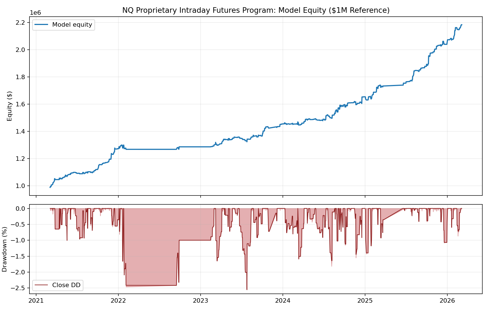
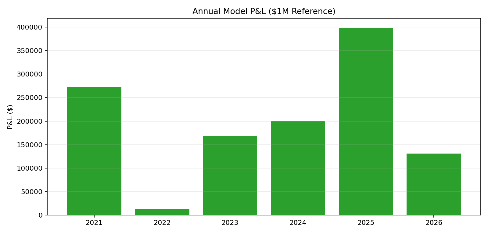
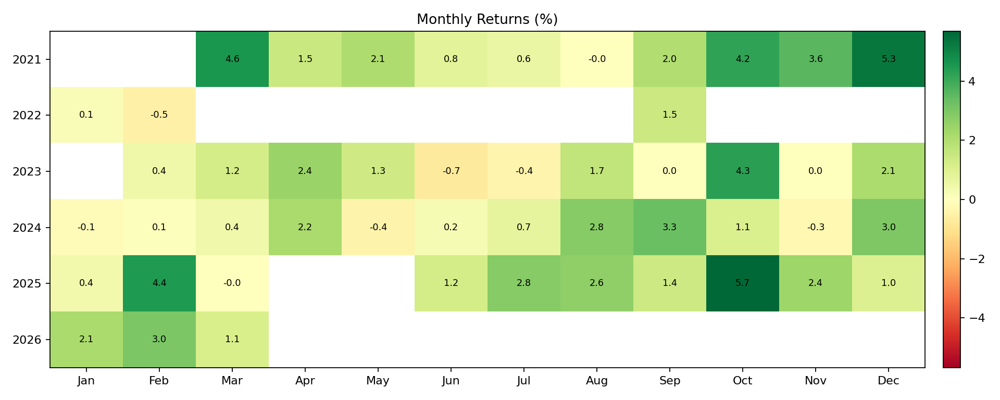

# NQ Proprietary Intraday Futures Program - Performance Tear Sheet

**Distribution status:** draft for diligence review. This document contains simulated/backtested performance, not audited live CTA performance.

**Hypothetical performance notice:** Results shown are simulated or hypothetical and have material limitations. They do not represent actual client trading. They may not reflect all market-impact, liquidity, operational, psychological, or implementation risks. Compliance counsel should review this document and insert any required CFTC/NFA prescribed language before external distribution.

## Executive Snapshot

**2026-07-16 promotion baseline:** resting-limit **hour-complete** (ST available at `live_after+1h`). Lookahead re-review: SOLID. Legacy fill-stamp figures are obsolete for promotion.

| Metric | Value (hour-complete resting-limit) |
| --- | --- |
| Program | NQ Proprietary Intraday Futures Program |
| Performance type | Simulated broker-like internal replay |
| Window | 2021-03-04 to 2026-03-06 |
| Base-book net | $1,330,920 |
| $1M model ending equity | $2,330,920 |
| $1M model net return | 133.1% |
| Max intrabar / MTM stress DD | $-68,610 |
| Max closed DD | $-68,110 |
| Profit factor | 2.33 |
| Campaign win rate | 66.0% |
| Net / stress DD | 19.40 |
| Campaigns / unit exits | 432 / 2,160 |

## Strategy Description

- Instrument: **NQ futures**.
- Signal family: proprietary multi-timeframe intraday setup using a directional gate and later opposing price-confirmation trigger.
- Entry logic: early-session range and momentum conditions are evaluated causally; orders are armed only after confirming data is available.
- Position management: capped intraday exposure, predefined partial exits, protective stop management, and session-end flattening.
- Replay engine: internal order-lifecycle replay; orders are active only after confirming bars close.
- Realism baseline: 1-tick adverse slippage on market/stop fills, stop gap-through fills, stop-first same-bar ambiguity, and $1.50 fee per closed unit in the audit.
- External diligence note: exact signal formulas, timing parameters, and sizing map are intentionally omitted from this draft and can be handled separately under diligence/NDA.

## Annual Stability

| Year | Campaigns | Net | Win % | PF | Closed DD | Net/DD |
| --- | --- | --- | --- | --- | --- | --- |
| 2021 | 77 | $273,142 | 72.7% | 3.74 | $-10,815 | 25.26 |
| 2022 | 16 | $13,425 | 56.2% | 1.17 | $-31,382 | 0.43 |
| 2023 | 73 | $168,292 | 68.5% | 2.43 | $-34,652 | 4.86 |
| 2024 | 93 | $199,522 | 64.5% | 1.89 | $-24,945 | 8.00 |
| 2025 | 74 | $399,000 | 71.6% | 4.09 | $-22,815 | 17.49 |
| 2026 | 19 | $131,202 | 84.2% | 5.70 | $-15,465 | 8.48 |

## Robustness Read

- Weakest year: **2022**, with $13,425 net and 1.17 PF. It remained positive but was not a strong year.
- Rolling 50-campaign PF never dropped below 1.0 in the robustness audit.
- Top 10 winners account for roughly 28% of total net; deleting the top 10 still left the strategy positive in the robustness pass.
- First risk-control lever: reduce size in the widest early-session range bucket; the internal reduced-size variant kept $1,137,539 net and improved reconstructed Net/Stress to 30.04.
- CPI/FOMC skipping did **not** improve the base row; event study base remained $1,184,585 and 25.60 reconstructed Net/Stress.

## Cross-Market Confirmation

| Market | Campaigns | Net | Stress DD | Win % | PF | Net/Stress |
| --- | --- | --- | --- | --- | --- | --- |
| NQ | 352 | $1,184,585 | $-53,847 | 69.3% | 2.65 | 22.00 |
| MNQ | 353 | $113,548 | $-5,418 | 68.6% | 2.52 | 20.96 |
| YM | 347 | $320,190 | $-26,835 | 59.6% | 1.85 | 11.93 |
| ES | 245 | $348,688 | $-33,164 | 63.7% | 2.08 | 10.51 |
| MYM | 333 | $26,054 | $-2,665 | 59.8% | 1.71 | 9.78 |

## Current Gating Risks

- The fill-book causal audit passes: NQ has **352 / 352** qualifying campaign entries and **0** causal violations.
- It is **not tick-proven yet**. NQ execution scrutiny marks 141 campaigns as bar-safe, 45 as same-minute ambiguous, and 166 as requiring deeper sequence review.
- The coarse one-minute review is encouraging but incomplete: most non-bar-safe campaigns later revisit the relevant price zone, with one rough no-later-touch case.
- The next diligence step is tick reconstruction and broker-paper shadow mode, not rule optimization.

## Internal Support

- Replay logs, chart packs, execution-scrutiny reports, and refresh scripts are archived internally.
- External distribution should use this tear sheet plus compliance-reviewed exhibits, not raw strategy source paths.
