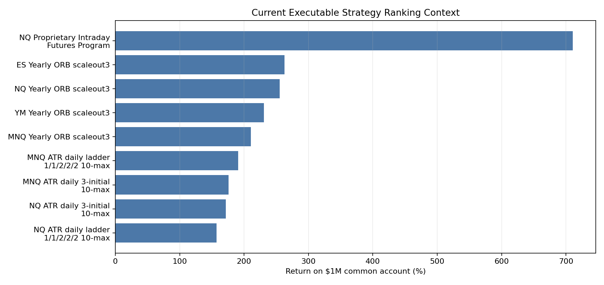

# Strategy Presentation Draft - aiSource CTA Diligence

**Use:** Markdown slide draft. Convert to PDF/PowerPoint after compliance review.

**Performance status:** simulated/backtested. No audited live CTA track record is presented in this draft.

---

## 1. Program Summary

- Primary program candidate: **NQ Proprietary Intraday Futures Program**.
- Design goal: intraday, rule-based futures exposure with hard order lifecycle rules and daily flat behavior.
- Core idea: a proprietary multi-timeframe condition identifies sessions where an initial directional impulse may set up a higher-quality opposing intraday opportunity.
- Current status: strong broker-like replay, cross-market confirmation, execution scrutiny pending tick proof and broker-paper parity.

---

## 2. What The Strategy Trades

- Market: **Nasdaq 100 futures (NQ)** as flagship; related index-futures markets confirm the pattern family.
- Timeframes: multi-timeframe intraday gate plus lower-timeframe execution path.
- Entry type: causal price-confirmation order after proprietary gate activation.
- Exit type: predefined partial exits, protective stops, adaptive runner management, and session-end flattening.

---

## 3. Why This Is Different

- The strategy does not blindly trade every intraday breakout.
- It waits for a proprietary intraday gate before allowing a later opposing price-confirmation campaign.
- The initial directional gate is not the main profit source; the edge is in the conditional follow-on campaign.
- This delayed, causal arming path is different from filtering a completed trade tape after the fact.

---

## 4. Performance Snapshot

| Metric | Value |
| --- | --- |
| Window | 2021-03-04 to 2026-03-06 |
| Net, base book | $1,184,585 |
| $1M reference return | 118.5% |
| CAGR, $1M reference | 16.9% |
| Intrabar stress DD | $-53,847 |
| Win rate / PF | 69.3% / 2.65 |
| Net / stress DD | 22.00 |

---

## 5. Current Ranking Context

The common-account view gives each setup the same $1,000,000 account, uses integer base books only, and leaves idle cash idle.

| Rank | Strategy | Books | Net | Return | Stress DD | Net/DD |
| --- | --- | --- | --- | --- | --- | --- |
| 1 | NQ Proprietary Intraday Futures Program | 6 | $7,107,510 | 710.8% | $-323,082 | 22.00 |
| 2 | ES Yearly ORB scaleout3 | 8 | $2,629,822 | 263.0% | $-323,224 | 8.14 |
| 3 | NQ Yearly ORB scaleout3 | 3 | $2,550,942 | 255.1% | $-320,160 | 7.97 |
| 4 | YM Yearly ORB scaleout3 | 8 | $2,310,054 | 231.0% | $-318,480 | 7.25 |
| 5 | MNQ Yearly ORB scaleout3 | 31 | $2,106,206 | 210.6% | $-330,739 | 6.37 |

---

## 6. Robustness Findings

- Positive yearly record in every tested year, but **2022 is weak** and should be discussed openly.
- Wide early-session range days degrade most sharply; a reduced-size range-width rule improves reconstructed efficiency but is not yet part of the frozen strategy.
- CPI/FOMC date skipping did not beat the base rule in the first official-date audit.
- Top-winner deletion leaves the strategy profitable, but right-tail concentration is real.

---

## 7. Execution Readiness

- Broker-like replay uses the same internal order-lifecycle framework intended for automation.
- Causal gate check: **0 violations** across NQ, MNQ, ES, YM, and MYM.
- Current blocker: same-minute ambiguous and sequence-sensitive campaigns need tick reconstruction.
- Next stage: signal-only shadow mode, EOD replay parity, then small broker-paper sizing.

---

## 8. Risk Controls

- Session-end flattening.
- Bracketed campaign exits with protective stops, partial exits, and runner management.
- Replay realism includes slippage, stop gap-through, and stop-first ambiguity.
- Proposed live-readiness controls: stale-feed kill switch, duplicate/out-of-order bar detection, broker reconciliation, and no duplicate re-arming after restart.

---

## 9. Compliance Positioning

- Present as **hypothetical/simulated performance** until actual managed-account performance exists.
- Keep assumptions next to every performance table.
- Add exact CFTC/NFA hypothetical-performance disclaimer language after counsel review.
- Do not imply audited live performance, client results, or guaranteed capacity.

---

## 10. CTA Launch Roadmap

1. Tick-reconstruct sequence-sensitive campaigns.
2. Run signal-only live shadow mode and replay persisted feed at EOD.
3. Paper trade with one-contract-equivalent sizing.
4. Document brokerage, latency, error handling, and reconciliation.
5. Only then produce an actual-performance supplement.
