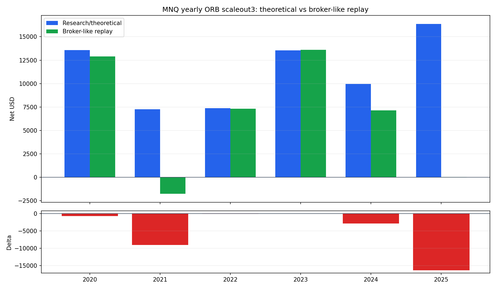

# MNQ Yearly ORB: Theoretical vs Broker-Like Replay

This compares the original `yearly_orb_swing_stop_scaleout3_inside_range_swing_range_close` research CSV against the live-runtime `StrategyPlugin` + `PaperBroker` fill book. The trade-pair table is aligned by yearly sequence, so years where broker-like timing skips a campaign should be read as an audit guide rather than a perfect one-to-one fill match.

## Headline

| Book | Trades | Wins | Net | Stress / DD note |
|---|---:|---:|---:|---|
| Research/theoretical CSV | 26 | 10 | $68,081.62 | Research one-page sheet reports -$4,604 MTM/open-heat stress. |
| Broker-like replay fills | 24 | 6 | $39,216.62 | Replay summary stress DD: -$13,378.50. |
| Difference | -2 | -4 | -$28,865.00 | Timing and order-state realism cost both profit and heat profile. |

## Yearly Delta

| Year | Research Trades | Broker Trades | Research Net | Broker-Like Net | Delta |
|---:|---:|---:|---:|---:|---:|
| 2020 | 2 | 2 | $13,574.12 | $12,895.62 | -$678.50 |
| 2021 | 5 | 4 | $7,256.62 | -$1,758.00 | -$9,014.62 |
| 2022 | 6 | 6 | $7,376.75 | $7,307.25 | -$69.50 |
| 2023 | 3 | 3 | $13,544.75 | $13,590.25 | $45.50 |
| 2024 | 6 | 6 | $9,961.38 | $7,145.25 | -$2,816.12 |
| 2025 | 4 | 3 | $16,368.00 | $36.25 | -$16,331.75 |

## Largest Sequence-Level Bleeds

| Year | Seq | Research Entry -> Exit | Broker Entry -> Exit | Research Reason | Broker Reason | Delta |
|---:|---:|---|---|---|---|---:|
| 2025 | 4 | 2025-06-24 -> 2025-12-31 | missing -> missing | TP25+TP+Period-Close | missing | -$14,587.12 |
| 2021 | 5 | 2021-06-17 -> 2021-12-31 | missing -> missing | TP25+TP+Period-Close | missing | -$9,098.62 |
| 2025 | 2 | 2025-04-10 -> 2025-04-13 | 2025-04-13 -> 2025-04-14 | TP25+Range-Close | close | -$1,745.62 |
| 2024 | 5 | 2024-08-13 -> 2024-09-06 | 2024-09-06 -> 2024-09-08 | TP25+Range-Close | close | -$1,717.12 |
| 2024 | 4 | 2024-06-04 -> 2024-08-02 | 2024-06-05 -> 2024-08-04 | TP25+Range-Close | target+stop+runner_stop | -$1,074.00 |
| 2020 | 1 | 2020-06-05 -> 2020-06-11 | 2020-06-08 -> 2020-06-12 | Range-Close | stop+runner_stop | -$637.50 |
| 2024 | 3 | 2024-05-24 -> 2024-05-30 | 2024-05-29 -> 2024-05-31 | Range-Close | stop+runner_stop | -$84.00 |
| 2022 | 6 | 2022-08-26 -> 2022-12-30 | 2022-09-13 -> 2023-01-03 | TP25+Period-Close | close+target | -$46.00 |

## Where Value Bleeds

- The research CSV can record a boundary entry on the breakout/retest day. The broker-like plugin only submits orders after a completed daily close confirms the condition, so fills often occur on a later retest or are skipped.
- Research range-close exits use the daily close level in the CSV. The broker-like strategy currently emits a `market` close intent after the completed daily bar, so the fill is the next tradable daily open in the paper broker.
- Broker bracket stops are active once the parent fills. Some campaigns that were small range-close losses in the research book become full swing-stop losses under broker-like sequencing.
- The broker-like book has fewer filled packages: skipped or delayed entries reduce the number of large runner campaigns that paid for churn in the theoretical result.

## Artifacts

- Yearly comparison CSV: [theoretical_vs_broker_like_yearly.csv](theoretical_vs_broker_like_yearly.csv)
- Sequence comparison CSV: [theoretical_vs_broker_like_trade_pairs.csv](theoretical_vs_broker_like_trade_pairs.csv)
- Existing broker-like charts: [INDEX.md](INDEX.md)
- Existing theoretical charts: ../../../../../../mnq/case_studies/yearly_orb_swing_stop_scaleout3_inside_range_swing_range_close/INDEX.md

Potential next experiment: add an explicit `market_close` close-intent mode for daily range-close exits and rerun the broker-like replay. That isolates how much damage comes from next-open fills versus delayed entry/order activation.
