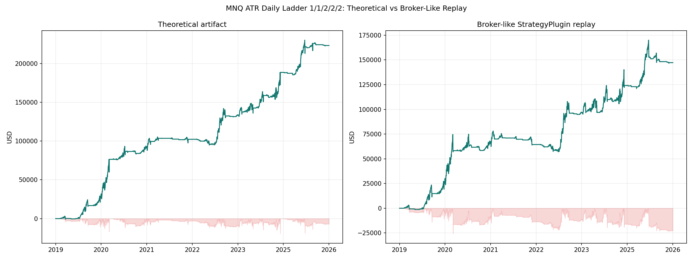
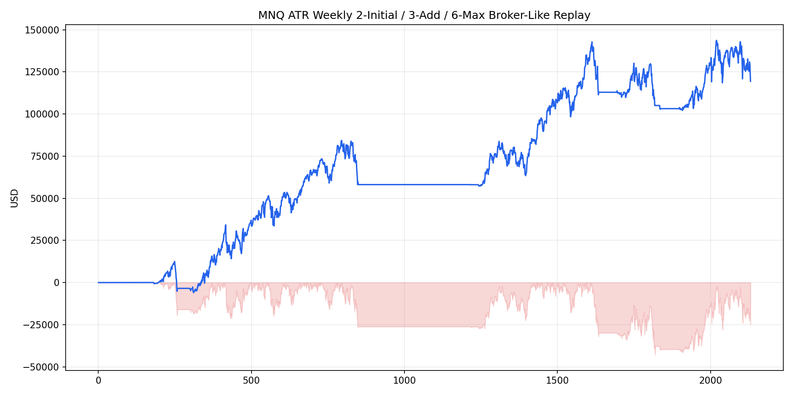

# Broker-Like Replay Charts

> **PRE-REALISM-FIX SNAPSHOT (2026-05-19 or earlier).** These charts were
> generated *before* the 2026-05-20 broker realism re-baseline (slippage,
> stop gap-through, fees, OCO-collapsed risk). The same strategy specs
> (`monthly_orb_restricted_scaleout3_boundary_stop` etc.) are also covered in
> [`../../broker_like_replays/charts/detail/INDEX.md`](../../broker_like_replays/charts/detail/INDEX.md)
> under the realism baseline. Use that as the authoritative chart pack; this
> folder is retained for audit/diff only.

