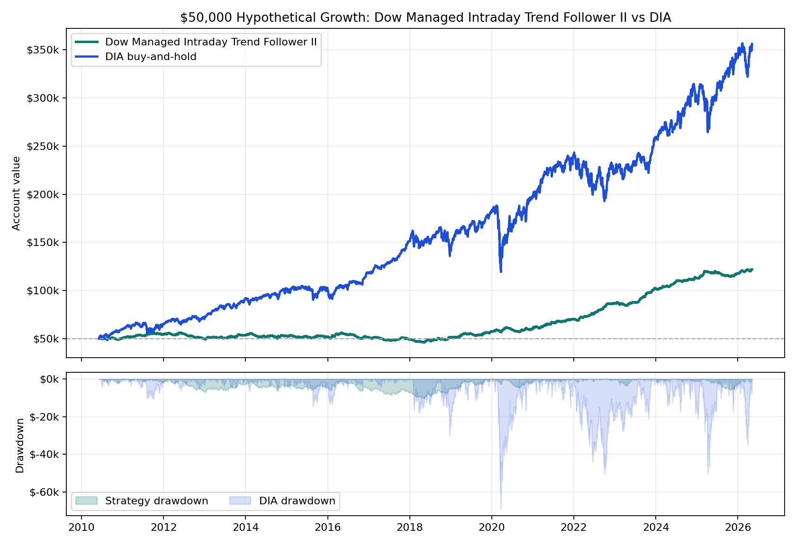

# Dow Managed Intraday Trend Follower II vs DIA

**One-page hypothetical exhibit.** Starting capital is **$50,000** for both paths. The managed intraday sleeve uses a rules-based futures replay; DIA uses adjusted-close buy-and-hold over the same available window.

## Headline

- **Dow Managed Intraday Trend Follower II:** $121,989.69 ending value, $71,989.69 net, **144.0% total return**.
- **DIA buy-and-hold:** $356,127.86 ending value, $306,127.86 net, **612.3% total return**.
- Strategy max daily drawdown on this account path: **20.8%**.
- Worst annual DIA daily drawdown as a share of that year's starting balance: **38.1%**.

## Institutional Metrics

| Metric | Managed intraday sleeve |
|---|---:|
| Pitch window | 2010-06-06 to 2026-05-06 |
| Account-path CAGR | 5.8% |
| Sharpe / Sortino | 0.87 / 1.73 |
| Calmar on account drawdown | 0.28 |
| Net / modeled stress DD | 6.93 |
| Max drawdown duration | 1444 days |
| Daily skew | 1.29 |
| DIA corr / downside capture | 0.00 / 0.00 |
| Profit factor / campaign win rate | 1.26 / 30.4% |
| Campaigns | 2,017 |
| Modeled stress DD | $-10,381 |

## Annual Table

| Year | Strategy Start | Strategy Net | Strategy Return | Strategy DD % | DIA Start | DIA Net | DIA Return | DIA DD % |
|---:|---:|---:|---:|---:|---:|---:|---:|---:|
| 2010 | $50,000 | $624 | **1.2%** | 4.6% | $50,000 | $9,826 | **19.7%** | 7.8% |
| 2011 | $50,624 | $3,480 | **6.9%** | 3.8% | $59,826 | $4,821 | **8.1%** | 17.8% |
| 2012 | $54,104 | $-4,645 | **-8.6%** | 12.7% | $64,647 | $6,424 | **9.9%** | 9.4% |
| 2013 | $49,460 | $4,599 | **9.3%** | 3.6% | $71,071 | $21,067 | **29.6%** | 6.9% |
| 2014 | $54,059 | $-1,345 | **-2.5%** | 10.5% | $92,138 | $8,958 | **9.7%** | 7.0% |
| 2015 | $52,714 | $-487 | **-0.9%** | 6.0% | $101,096 | $91 | **0.1%** | 14.4% |
| 2016 | $52,227 | $-841 | **-1.6%** | 12.4% | $101,187 | $16,567 | **16.4%** | 8.3% |
| 2017 | $51,386 | $-2,420 | **-4.7%** | 7.4% | $117,754 | $33,070 | **28.1%** | 3.4% |
| 2018 | $48,967 | $2,280 | **4.7%** | 7.3% | $150,824 | $-5,645 | **-3.7%** | 19.9% |
| 2019 | $51,247 | $6,339 | **12.4%** | 5.4% | $145,179 | $36,333 | **25.0%** | 7.9% |
| 2020 | $57,586 | $3,227 | **5.6%** | 8.4% | $181,513 | $17,408 | **9.6%** | 38.1% |
| 2021 | $60,813 | $9,398 | **15.5%** | 3.1% | $198,920 | $41,427 | **20.8%** | 7.7% |
| 2022 | $70,210 | $16,706 | **23.8%** | 2.4% | $240,347 | $-16,861 | **-7.0%** | 21.0% |
| 2023 | $86,916 | $15,530 | **17.9%** | 4.2% | $223,486 | $35,801 | **16.0%** | 9.3% |
| 2024 | $102,445 | $10,437 | **10.2%** | 1.5% | $259,286 | $38,439 | **14.8%** | 7.2% |
| 2025 | $112,882 | $4,965 | **4.4%** | 5.2% | $297,725 | $43,783 | **14.7%** | 16.7% |
| 2026 | $117,847 | $4,142 | **3.5%** | 1.8% | $341,508 | $14,620 | **4.3%** | 10.2% |

## Read

This is positioned as a **Dow trend-following intraday sleeve**. It is not the flagship gated product; it is a complementary sleeve that may be easier to explain once live broker-paper parity is proven.

**Important caveat:** this remains hypothetical/backtested performance. The strategy still needs tick/order-sequence proof and broker-paper parity before live capital decisions.

## Internal Sources

- Equity curve: `live/state/hourly_st_pmc_strategyplugin_variants/audits/ym_hourly_st_pmc_sl40_tp120_3r/ym_hourly_st_pmc_sl40_tp120_3r/equity_curve.csv`
- Campaign fills: `live/state/hourly_st_pmc_strategyplugin_variants/audits/ym_hourly_st_pmc_sl40_tp120_3r/ym_hourly_st_pmc_sl40_tp120_3r/unit_fills.csv`
- Summary source: `live/state/hourly_st_pmc_strategyplugin_variants/summary.csv`
