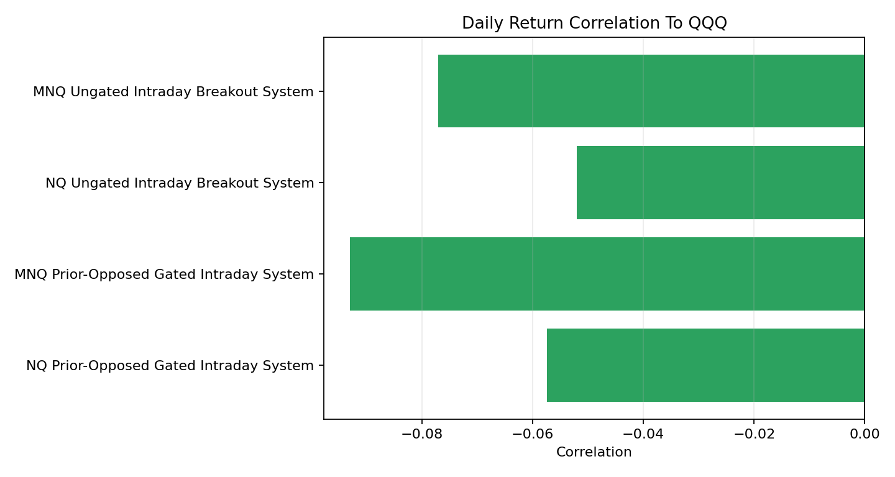
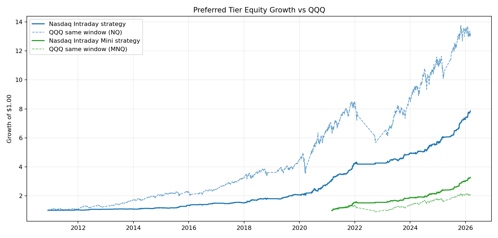
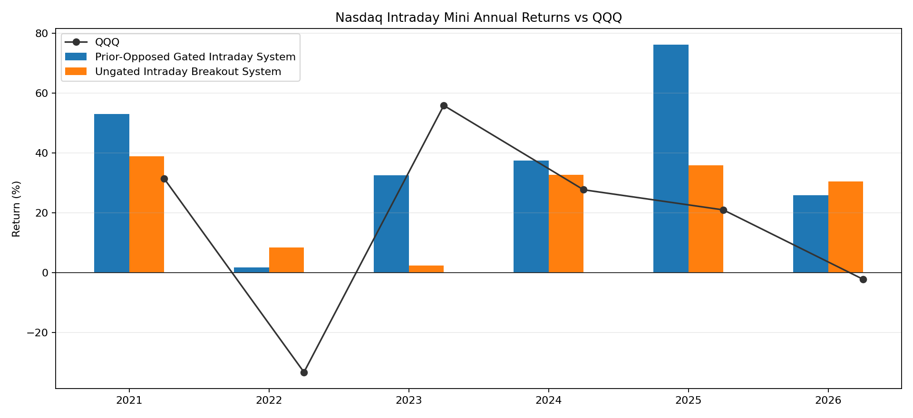

# Nasdaq Futures Diversification Platform - Private Funding Deck

**Status:** private diligence draft for family/friends funding discussions. All trading results are hypothetical/backtested, unaudited, and not a live managed-account track record.

---

## 1. The Ask

- Seeking **about $145,000** to fund a CTA-registration-first 12-month build/test runway.
- Use of funds: platform development, live data, broker-paper validation, CTA registration/disclosure work, and segregated MNQ research/test capital.
- This is not framed as an immediate public CTA solicitation or a promise of returns.
- No compensated futures advice, managed client trading, or client account direction should begin until counsel confirms the required registration/exemption, disclosure, and account-documentation path.
- The initial research and validation path stays on MNQ to keep operating risk and research cost controlled.

---

## 2. Why This Exists

- Most prospective investors already have stock and real-estate exposure.
- The product goal is a futures-based diversification tool that can behave differently from QQQ.
- Existing research shows slightly negative daily return correlation to QQQ across the selected intraday systems.
- The build phase is meant to prove execution, reporting, and risk controls before scaling.

---

## 3. Founder Partner Exchange

Family and friends would be taking the earliest and most personal risk: funding an unproven live-test build before there is an audited managed-account record. The value of that support is not just capital; it creates the conditions for an auditable operating history, live execution evidence, and a future CTA-ready platform.

| What They Provide | Proposed Exchange |
| --- | --- |
| Early risk capital and patience | Priority access to the earliest validated capacity if the program launches |
| Trust before an audited track record exists | Founder economics target: 0% management / 10% performance fee, subject to counsel-approved documents |
| A path to build a real operating record | Option to carry their validated allocation into a future compliant CTA-style product or withdraw after review windows |

If the firm later scales, these accounts should be documented through counsel-reviewed founder terms or side letters. This is not a guarantee of returns, capacity, fee treatment, or a future offering; it is the intended alignment principle for people who help make the platform possible.

---

## 4. Product Tiers

| Tier | Market | Minimum | Use |
| --- | --- | --- | --- |
| Nasdaq Intraday Mini | MNQ | $50,000 | Lower-cost research/live-test tier |
| Nasdaq Intraday | NQ | $250,000 | Future larger-account tier after validation |

---

## 5. Systems Under Development

- **Prior-Opposed Gated Intraday System:** flagship conditional intraday strategy. It waits for a proprietary market condition before allowing a later opposing campaign.
- **Ungated Intraday Breakout System:** secondary all-day intraday strategy. It is simpler and useful as a benchmark, but less selective.
- Exact signal formulas, timing rules, and sizing maps are intentionally omitted from this private deck.

---

## 6. Conservative Performance Framing

Headline expected-return framing removes each system's top 3 annual net years, then averages the remaining annual results.

| Tier | System | Market | Minimum | Window | Total Net | Advertised Avg/Yr | Advertised Return/Yr | Corr to QQQ |
| --- | --- | --- | --- | --- | --- | --- | --- | --- |
| Nasdaq Intraday | Prior-Opposed Gated Intraday System | NQ | $250,000 | 2010-11-29 to 2026-03-06 | $1,713,278 | $57,990 | 23.2% | -0.06 |
| Nasdaq Intraday Mini | Prior-Opposed Gated Intraday System | MNQ | $50,000 | 2021-03-04 to 2026-03-06 | $113,548 | $10,048 | 20.1% | -0.09 |
| Nasdaq Intraday | Ungated Intraday Breakout System | NQ | $250,000 | 2021-03-04 to 2026-03-06 | $867,355 | $85,889 | 34.4% | -0.05 |
| Nasdaq Intraday Mini | Ungated Intraday Breakout System | MNQ | $50,000 | 2021-03-04 to 2026-03-06 | $74,442 | $6,891 | 13.8% | -0.08 |

---

## 7. QQQ Diversification Evidence

QQQ comparisons follow the fair-benchmark convention: the passive benchmark invests the full tier minimum in QQQ over the same clipped strategy window, while the futures row starts with that same tier minimum plus realized strategy P&L.

| System | Corr | Avg in QQQ Down Years | QQQ Down Years |
| --- | --- | --- | --- |
| MNQ Prior-Opposed Gated Intraday System | -0.09 | 13.9% | 2022, 2026 |
| MNQ Ungated Intraday Breakout System | -0.08 | 19.5% | 2022, 2026 |
| NQ Prior-Opposed Gated Intraday System | -0.06 | 28.4% | 2018, 2022, 2026 |
| NQ Ungated Intraday Breakout System | -0.05 | 40.1% | 2022, 2026 |

---

## 8. Preferred Tier Equity vs QQQ

---

## 9. Capital-Efficiency Context For Test Systems

This table keeps the buyer-facing view focused on the two systems planned for development. The normalized column uses the same common stress-capital anchor as the research tracker, while the executable column shows whole-book feasibility on a $1,000,000 account.

| System | Norm Scale | Norm Net | Norm Return | Norm Net/DD | $1M Books | $1M Net | $1M Return |
| --- | --- | --- | --- | --- | --- | --- | --- |
| Gated intraday | 5.74x | $6,799,226 | 733.3% | 22.00 | 6 | $7,107,510 | 710.8% |
| Ungated intraday | 2.62x | $2,269,999 | 244.8% | 7.34 | 2 | $1,734,710 | 173.5% |

---

## 10. Nasdaq Intraday Mini Year-By-Year

---

## 11. 12-Month Build Roadmap

1. **Months 1-3:** CTA counsel kickoff, Series 3/NFA registration prep, source-data audit, Tradovate/StoneX adapter work, live-data shadow mode.
2. **Months 4-6:** disclosure-document drafting/review, broker-paper routing, reconciliation, restart drills, emergency flatten drills, first readiness review.
3. **Months 7-9:** extended MNQ funded-paper or small-live observation, ungated-system comparison, investor reporting packet.
4. **Months 10-12:** regime review, QQQ comparison refresh, compliance/accounting package, registration/disclosure go/no-go, final MNQ/NQ tier decision.

---

## 12. 12-Month Budget

- Total target: **$145,000**.
- Largest line items: founder development stipend and segregated MNQ research/test capital.
- The cost model now assumes StoneX for futures execution, using the supplied commission and account-fee schedule.
- CTA registration, disclosure-document counsel, audit/accounting setup, and NFA response reserve are now first-class budget items before taking or managing outside trading capital.

See [COST_AND_RUNWAY.md](COST_AND_RUNWAY.md).

---

## 13. API Exception Handling & State Reconciliation

The platform treats broker/API failures as operational risk, not as afterthoughts.

| Failure | System Response |
| --- | --- |
| Tradovate WebSocket/feed loss | Freeze new entries, reconnect with backoff, reconcile before resume |
| Ambiguous order placement | Prevent secondary orders, query broker order state, block if unresolved |
| Local vs broker state mismatch | Treat broker ledger as truth, overwrite local audit mirror, resume only after reconciliation |
| Manual kill switch | Cancel working MNQ/NQ/MYM orders and flatten through broker-level controls |

Core principle: strategies can only arm new entries when runtime state is `running`. Protective exits, emergency flattening, and broker reconciliation stay available even during feed or API faults.

---

## 14. Risk Positioning

- Futures are leveraged and can lose more than expected when markets gap or systems fail.
- Backtests are not live results.
- The platform must prove feed integrity, order handling, reconciliation, and reporting before any client-scale allocations.
- Materials and account documents need counsel review before being used for solicitation or advisory activity.
- A human kill switch, daily flattening, stale-feed blocks, and broker/local position reconciliation are required controls.

---

## 15. Next Step

- Fund the CTA-registration-first 12-month build/test runway.
- Review monthly operating reports.
- Decide after the pilot and counsel/regulatory review whether the platform is ready for broader family/friends capital.

Internal data exhibits live in `exhibits/`. Public-facing numbers should be reviewed by counsel before distribution.
