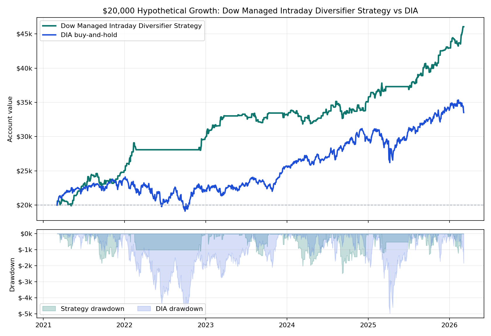

# Dow Managed Intraday Diversifier Strategy vs DIA

**One-page hypothetical exhibit.** Starting capital is **$20,000** for both paths. The managed intraday strategy uses a rules-based futures replay; DIA uses adjusted-close buy-and-hold over the same available window.

## Headline

- **Dow Managed Intraday Diversifier Strategy:** $46,053.62 ending value, $26,053.62 net, **130.3% total return**.
- **DIA buy-and-hold:** $33,514.95 ending value, $13,514.95 net, **67.6% total return**.
- Worst annual strategy closed DD as a share of that year's starting balance: **9.2%**.
- Worst annual DIA daily drawdown as a share of that year's starting balance: **21.0%**.

## Annual Table

| Year | Strategy Start | Strategy Net | Strategy Return | Strategy Closed DD | Strategy DD % | DIA Start | DIA Net | DIA Return | DIA DD % |
|---:|---:|---:|---:|---:|---:|---:|---:|---:|---:|
| 2021 | $20,000 | $5,028 | **25.1%** | $-1,841 | 9.2% | $20,000 | $3,814 | **19.1%** | 7.6% |
| 2022 | $25,028 | $4,795 | **19.2%** | $-1,076 | 4.3% | $23,814 | $-1,671 | **-7.0%** | 21.0% |
| 2023 | $29,823 | $3,435 | **11.5%** | $-1,356 | 4.5% | $22,143 | $3,547 | **16.0%** | 9.3% |
| 2024 | $33,258 | $1,789 | **5.4%** | $-2,482 | 7.5% | $25,691 | $3,809 | **14.8%** | 7.2% |
| 2025 | $35,047 | $7,899 | **22.5%** | $-1,282 | 3.7% | $29,499 | $4,338 | **14.7%** | 16.7% |
| 2026 | $42,946 | $3,107 | **7.2%** | $-1,204 | 2.8% | $33,837 | $-322 | **-1.0%** | 5.4% |

## Read

This strategy path is not a replacement for equity exposure; it is a small futures sleeve designed to behave differently from a passive Dow ETF. The attractive part is consistency: every tested calendar segment is positive, including 2022 when DIA was negative. The weak point is 2024, where the edge remained positive but compressed sharply.

**Important caveat:** this remains hypothetical/backtested performance. The strategy still needs tick/order-sequence proof and broker-paper parity before live capital decisions.
