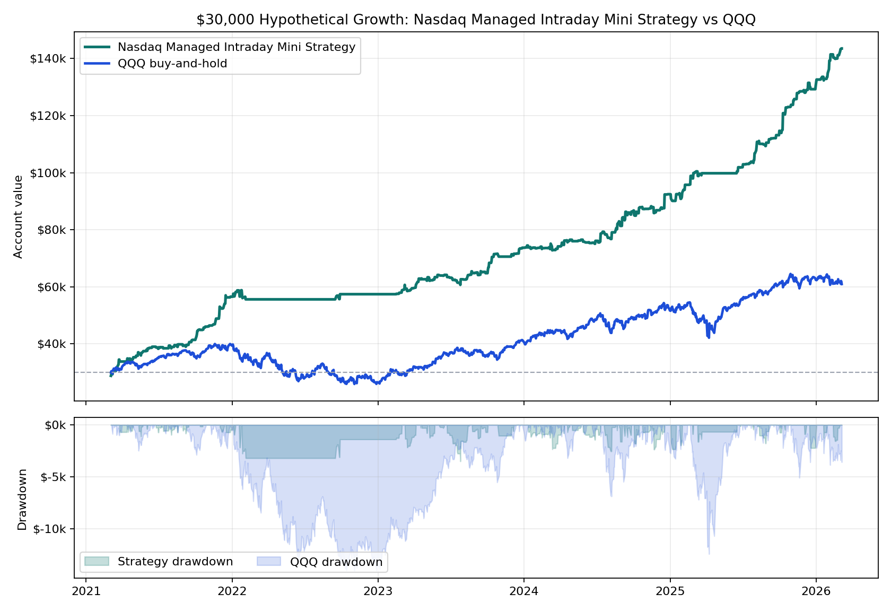

# Nasdaq Managed Intraday Mini Strategy vs QQQ

**One-page hypothetical exhibit.** Starting capital is **$30,000** for both paths. The managed intraday strategy uses a rules-based micro Nasdaq futures replay; QQQ uses adjusted-close buy-and-hold over the same available window.

## Headline

- **Nasdaq Managed Intraday Mini Strategy:** $143,547.50 ending value, $113,547.50 net, **378.5% total return**.
- **QQQ buy-and-hold:** $60,969.37 ending value, $30,969.37 net, **103.2% total return**.
- Worst annual strategy closed DD as a share of that year's starting balance: **6.1%**.
- Worst annual QQQ daily drawdown as a share of that year's starting balance: **35.2%**.

## Annual Table

| Year | Strategy Start | Strategy Net | Strategy Return | Strategy Closed DD | Strategy DD % | QQQ Start | QQQ Net | QQQ Return | QQQ DD % |
|---:|---:|---:|---:|---:|---:|---:|---:|---:|---:|
| 2021 | $30,000 | $26,560 | **88.5%** | $-1,098 | 3.7% | $30,000 | $9,438 | **31.5%** | 9.6% |
| 2022 | $56,560 | $874 | **1.5%** | $-3,196 | 5.7% | $39,438 | $-12,848 | **-32.6%** | 35.2% |
| 2023 | $57,434 | $16,291 | **28.4%** | $-3,494 | 6.1% | $26,590 | $14,586 | **54.9%** | 15.7% |
| 2024 | $73,726 | $18,747 | **25.4%** | $-2,535 | 3.4% | $41,176 | $10,532 | **25.6%** | 16.7% |
| 2025 | $92,472 | $38,097 | **41.2%** | $-2,300 | 2.5% | $51,708 | $10,741 | **20.8%** | 24.0% |
| 2026 | $130,570 | $12,978 | **9.9%** | $-1,550 | 1.2% | $62,450 | $-1,480 | **-2.4%** | 5.9% |

## Read

This strategy path is not a replacement for QQQ exposure; it is a micro-futures sleeve designed to create a different return stream around Nasdaq intraday movement. The attractive part is that the tested path stayed positive in every calendar segment, including 2022 when QQQ was negative. The weak point is that 2022 compressed sharply for the strategy too, so the next live-testing phase still needs to prove execution quality and edge persistence.

**Important caveat:** this remains hypothetical/backtested performance. The strategy still needs tick/order-sequence proof and broker-paper parity before live capital decisions.
