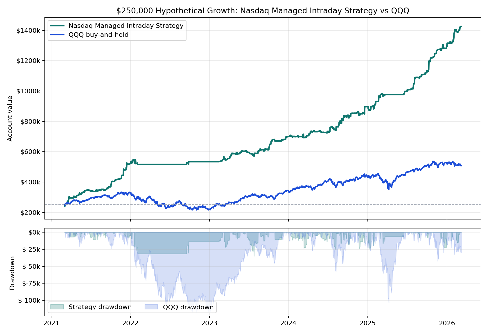

# Nasdaq Managed Intraday Strategy vs QQQ

**One-page hypothetical exhibit.** Starting capital is **$250,000** for both paths. The managed intraday strategy uses a rules-based futures replay; QQQ uses adjusted-close buy-and-hold over the same available window.

## Headline

- **Nasdaq Managed Intraday Strategy:** $1,434,585.00 ending value, $1,184,585.00 net, **473.8% total return**.
- **QQQ buy-and-hold:** $508,078.11 ending value, $258,078.11 net, **103.2% total return**.
- Worst annual strategy closed DD as a share of that year's starting balance: **6.5%**.
- Worst annual QQQ daily drawdown as a share of that year's starting balance: **35.2%**.

## Institutional Metrics

The headline above uses the simple **$250,000 starting-account path**. The institutional statistics below use the same hypothetical replay's daily return path and stress accounting.

| Metric | Managed intraday strategy |
|---|---:|
| Backtest window | 2021-03-04 to 2026-03-06 |
| $250,000-path CAGR | 42.9% |
| Sharpe / Sortino | 3.29 / 4.80 |
| Calmar / MAR on modeled stress | 1.58 |
| Calmar on worst annual closed DD | 6.64 |
| Max drawdown duration | 401 days |
| Daily skew | 2.63 |
| QQQ corr / downside capture | -0.11 / -1.31 |
| Profit factor / win rate | 2.65 / 69.3% |
| Modeled intrabar stress / closed DD | $-53,847 / $-53,172 |

## Annual Table

| Year | Strategy Start | Strategy Net | Strategy Return | Strategy Closed DD | Strategy DD % | QQQ Start | QQQ Net | QQQ Return | QQQ DD % |
|---:|---:|---:|---:|---:|---:|---:|---:|---:|---:|
| 2021 | $250,000 | $273,142 | **109.3%** | $-10,815 | 4.3% | $250,000 | $78,647 | **31.5%** | 9.6% |
| 2022 | $523,142 | $13,425 | **2.6%** | $-31,382 | 6.0% | $328,647 | $-107,064 | **-32.6%** | 35.2% |
| 2023 | $536,568 | $168,292 | **31.4%** | $-34,652 | 6.5% | $221,584 | $121,551 | **54.9%** | 15.7% |
| 2024 | $704,860 | $199,522 | **28.3%** | $-24,945 | 3.5% | $343,135 | $87,768 | **25.6%** | 16.7% |
| 2025 | $904,382 | $399,000 | **44.1%** | $-22,815 | 2.5% | $430,903 | $89,510 | **20.8%** | 24.0% |
| 2026 | $1,303,382 | $131,202 | **10.1%** | $-15,465 | 1.2% | $520,413 | $-12,335 | **-2.4%** | 5.9% |

## Read

This strategy path is not a replacement for passive QQQ exposure; it is a futures sleeve designed to behave differently from a buy-and-hold equity index ETF. The useful diligence question is whether the live implementation can preserve enough of the replay's return distribution after real broker routing, sequence checks, fees, and slippage.

**Important caveat:** this remains hypothetical/backtested performance. The strategy still needs tick/order-sequence proof and broker-paper parity before live capital decisions.
