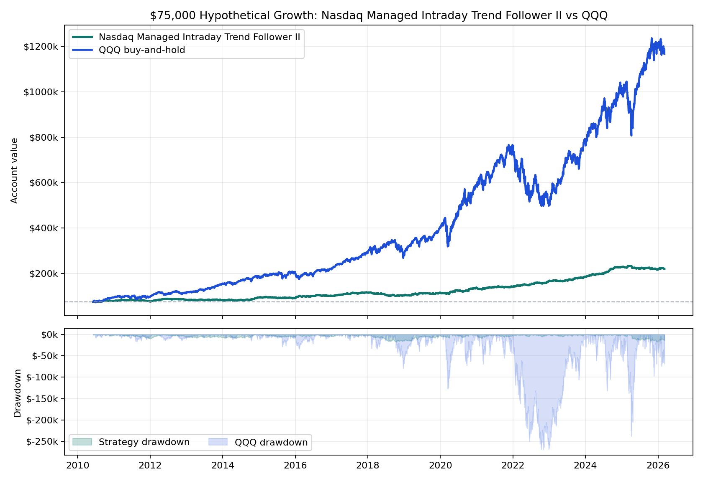

# Nasdaq Managed Intraday Trend Follower II vs QQQ

**One-page hypothetical exhibit.** Starting capital is **$75,000** for both paths. The managed intraday sleeve uses a rules-based futures replay; QQQ uses adjusted-close buy-and-hold over the same available window.

## Headline

- **Nasdaq Managed Intraday Trend Follower II:** $219,520.68 ending value, $144,520.68 net, **192.7% total return**.
- **QQQ buy-and-hold:** $1,167,913.10 ending value, $1,092,913.10 net, **1457.2% total return**.
- Strategy max daily drawdown on this account path: **23.4%**.
- Worst annual QQQ daily drawdown as a share of that year's starting balance: **35.2%**.

## Institutional Metrics

| Metric | Managed intraday sleeve |
|---|---:|
| Pitch window | 2010-06-06 to 2026-03-06 |
| Account-path CAGR | 7.1% |
| Sharpe / Sortino | 0.91 / 1.64 |
| Calmar on account drawdown | 0.30 |
| Net / modeled stress DD | 8.23 |
| Max drawdown duration | 875 days |
| Daily skew | 1.43 |
| QQQ corr / downside capture | 0.01 / 0.02 |
| Profit factor / campaign win rate | 1.24 / 29.8% |
| Campaigns | 1,683 |
| Modeled stress DD | $-17,553 |

## Annual Table

| Year | Strategy Start | Strategy Net | Strategy Return | Strategy DD % | QQQ Start | QQQ Net | QQQ Return | QQQ DD % |
|---:|---:|---:|---:|---:|---:|---:|---:|---:|
| 2010 | $75,000 | $2,820 | **3.8%** | 4.1% | $75,000 | $18,021 | **24.0%** | 10.1% |
| 2011 | $77,820 | $-1,757 | **-2.3%** | 11.7% | $93,021 | $3,233 | **3.5%** | 17.7% |
| 2012 | $76,063 | $6,479 | **8.5%** | 7.8% | $96,254 | $17,434 | **18.1%** | 14.7% |
| 2013 | $82,542 | $-339 | **-0.4%** | 4.2% | $113,688 | $41,649 | **36.6%** | 6.7% |
| 2014 | $82,203 | $10,747 | **13.1%** | 5.8% | $155,337 | $31,714 | **20.4%** | 9.5% |
| 2015 | $92,950 | $-2,374 | **-2.6%** | 8.2% | $187,051 | $15,550 | **8.3%** | 15.3% |
| 2016 | $90,575 | $10,090 | **11.1%** | 5.8% | $202,602 | $14,380 | **7.1%** | 11.8% |
| 2017 | $100,666 | $14,054 | **14.0%** | 4.5% | $216,982 | $70,874 | **32.7%** | 5.9% |
| 2018 | $114,720 | $-12,728 | **-11.1%** | 14.4% | $287,856 | $-363 | **-0.1%** | 27.4% |
| 2019 | $101,992 | $12,736 | **12.5%** | 6.4% | $287,493 | $112,012 | **39.0%** | 13.6% |
| 2020 | $114,728 | $21,278 | **18.5%** | 6.2% | $399,505 | $193,385 | **48.4%** | 31.8% |
| 2021 | $136,006 | $4,246 | **3.1%** | 4.9% | $592,889 | $162,569 | **27.4%** | 11.6% |
| 2022 | $140,252 | $26,196 | **18.7%** | 3.8% | $755,458 | $-246,106 | **-32.6%** | 35.2% |
| 2023 | $166,448 | $18,302 | **11.0%** | 2.8% | $509,352 | $279,408 | **54.9%** | 15.7% |
| 2024 | $184,750 | $43,249 | **23.4%** | 1.9% | $788,761 | $201,751 | **25.6%** | 16.7% |
| 2025 | $227,999 | $-9,302 | **-4.1%** | 7.7% | $990,512 | $205,754 | **20.8%** | 24.0% |
| 2026 | $218,697 | $824 | **0.4%** | 1.7% | $1,196,266 | $-28,353 | **-2.4%** | 5.9% |

## Read

This is positioned as a **trend-following intraday sleeve**. It is not the flagship gated product; it is a complementary sleeve that may be easier to explain once live broker-paper parity is proven.

**Important caveat:** this remains hypothetical/backtested performance. The strategy still needs tick/order-sequence proof and broker-paper parity before live capital decisions.

## Internal Sources

- Equity curve: `live/state/hourly_st_pmc_strategyplugin_variants_cross_market/nq/audits/nq_hourly_st_pmc_sl25_tp75_3r/nq_hourly_st_pmc_sl25_tp75_3r/equity_curve.csv`
- Campaign fills: `live/state/hourly_st_pmc_strategyplugin_variants_cross_market/nq/audits/nq_hourly_st_pmc_sl25_tp75_3r/nq_hourly_st_pmc_sl25_tp75_3r/unit_fills.csv`
- Summary source: `live/state/hourly_st_pmc_strategyplugin_variants_cross_market/summary.csv`
