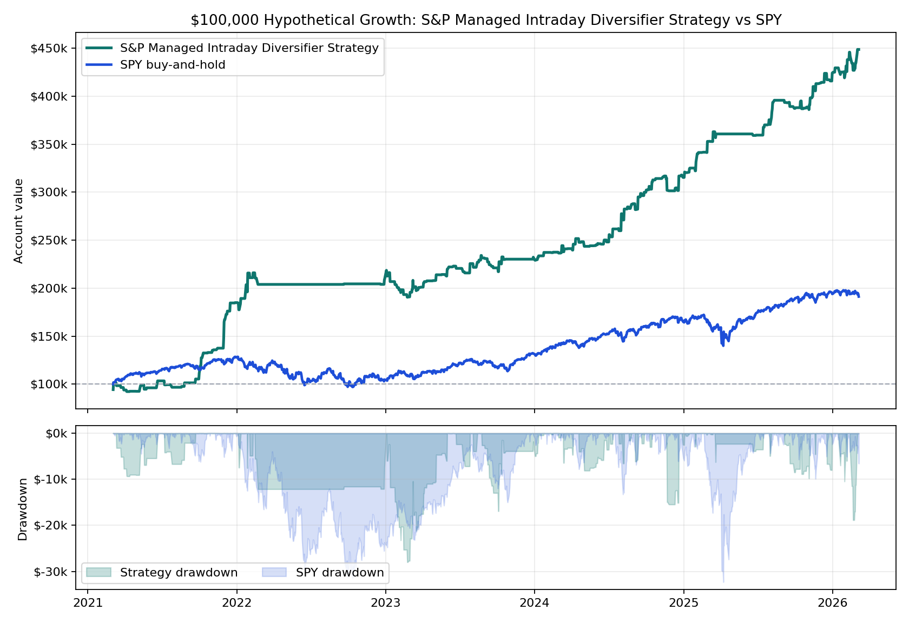

# S&P Managed Intraday Diversifier Strategy vs SPY

**One-page hypothetical exhibit.** Starting capital is **$100,000** for both paths. The managed intraday strategy uses a rules-based futures replay; SPY uses adjusted-close buy-and-hold over the same available window.

## Headline

- **S&P Managed Intraday Diversifier Strategy:** $448,687.50 ending value, $348,687.50 net, **348.7% total return**.
- **SPY buy-and-hold:** $191,212.33 ending value, $91,212.33 net, **91.2% total return**.
- Worst annual strategy closed DD as a share of that year's starting balance: **13.3%**.
- Worst annual SPY daily drawdown as a share of that year's starting balance: **24.6%**.

## Institutional Metrics

The headline above uses the simple **$100,000 starting-account path**. The institutional statistics below use the same hypothetical replay's daily return path and stress accounting.

| Metric | Managed intraday strategy |
|---|---:|
| Backtest window | 2021-03-04 to 2026-03-06 |
| $100,000-path CAGR | 36.6% |
| Sharpe / Sortino | 2.26 / 2.51 |
| Calmar / MAR on modeled stress | 1.05 |
| Calmar on worst annual closed DD | 2.75 |
| Max drawdown duration | 326 days |
| Daily skew | 2.25 |
| QQQ corr / downside capture | 0.04 / -0.32 |
| SPY corr / downside capture | 0.04 / -0.16 |
| Profit factor / win rate | 2.08 / 63.7% |
| Modeled intrabar stress / closed DD | $-33,164 / $-33,114 |

## Annual Table

| Year | Strategy Start | Strategy Net | Strategy Return | Strategy Closed DD | Strategy DD % | SPY Start | SPY Net | SPY Return | SPY DD % |
|---:|---:|---:|---:|---:|---:|---:|---:|---:|---:|
| 2021 | $100,000 | $84,938 | **84.9%** | $-9,280 | 9.3% | $100,000 | $27,765 | **27.8%** | 6.2% |
| 2022 | $184,938 | $25,288 | **13.7%** | $-12,078 | 6.5% | $127,765 | $-23,222 | **-18.2%** | 24.6% |
| 2023 | $210,225 | $22,030 | **10.5%** | $-27,950 | 13.3% | $104,543 | $27,365 | **26.2%** | 12.0% |
| 2024 | $232,255 | $83,092 | **35.8%** | $-15,455 | 6.7% | $131,908 | $32,827 | **24.9%** | 10.1% |
| 2025 | $315,348 | $108,720 | **34.5%** | $-9,765 | 3.1% | $164,736 | $29,190 | **17.7%** | 19.6% |
| 2026 | $424,068 | $24,620 | **5.8%** | $-18,810 | 4.4% | $193,925 | $-2,713 | **-1.4%** | 3.4% |

## Read

This strategy path is not a replacement for passive SPY exposure; it is a futures sleeve designed to behave differently from a buy-and-hold equity index ETF. The useful diligence question is whether the live implementation can preserve enough of the replay's return distribution after real broker routing, sequence checks, fees, and slippage.

**Important caveat:** this remains hypothetical/backtested performance. The strategy still needs tick/order-sequence proof and broker-paper parity before live capital decisions.
