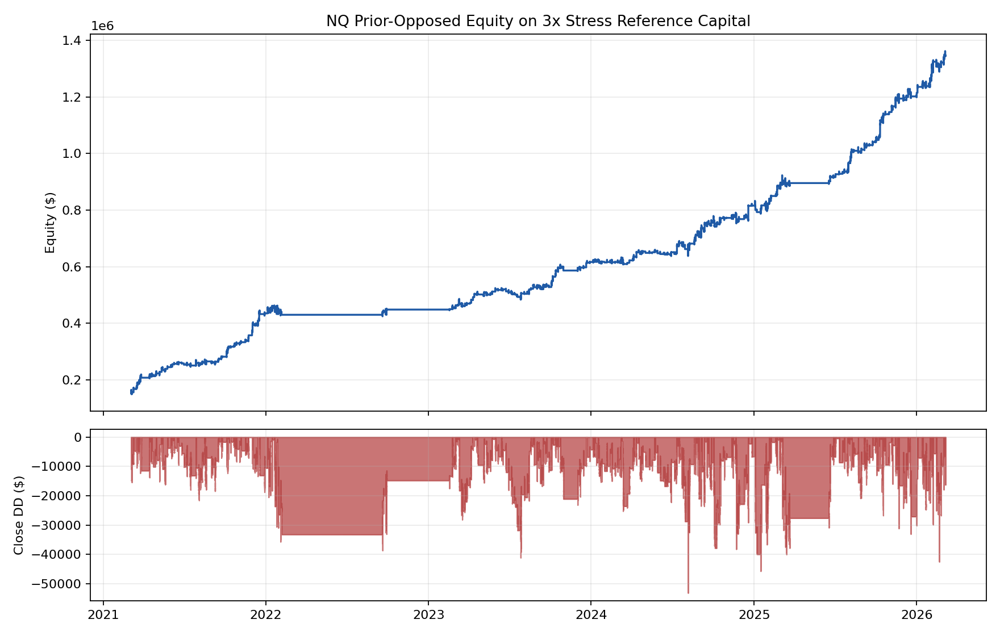

# NQ Intraday Validation One-Page

**Status:** hypothetical/backtested, unaudited. This page is for diligence planning, not a live CTA track record.

## Candidate

NQ intraday delayed-arming program. The exact gate mechanics remain proprietary; the validation question is whether the gate survives causality, null controls, and execution scrutiny.

## Backtested Profile

**2026-07-16 promotion baseline:** resting-limit **hour-complete**. Lookahead re-review: SOLID. Legacy fill-stamp Sharpe/Calmar remain diagnostic until regenerated on this equity.

| Metric | Value (hour-complete resting-limit) |
|---|---:|
| Window | 2021-03-04 to 2026-03-06 |
| Net, base book | $1,330,920 |
| Intrabar / MTM stress DD | $-68,610 |
| Closed DD | $-68,110 |
| Win % / PF | 66.0% / 2.33 |
| Net / stress DD | 19.40 |
| Campaigns | 432 |
| Gate | ST opposite limit knowably resting at hour-complete |

## Overfit Defense Now In Place

- Backfilled DSR trial ledger: **N_eff 53.00**.
- PSR vs zero Sharpe: **100.00%**.
- DSR zero benchmark: **100.00%**.
- Peer-benchmark DSR: **suppressed until direct peer Sharpe data is sourced**.
- Stratified gate null (200 seeds, structural): p = 0.0050 — under the null hypothesis of no edge, the probability of observing a net this extreme or greater by chance alone is 0.50%. This is NOT the probability that the strategy has no edge.
- Shuffled-label gate null (200 seeds, mechanistic): p = 0.0050 — under the null hypothesis of no edge, the probability of observing a net this extreme or greater by chance alone is 0.50%. This is NOT the probability that the strategy has no edge.
- Secondary all-day v2b sampling control: p=0.0005

## Qualitative Edge Decomposition (NQ)

Qualitative NQ edge decomposition (null families are **not orthogonal**; illustrative only):

| Component | Estimated contribution | Source |
| --- | --- | --- |
| Timing/structure alone (shuffled median) | $370,025 | Shuffled-label null |
| Gate placement precision within structure | $358,269 | Stratified p50 gap to shuffled p50 |
| Prior-opposed directional mechanic | $456,291 | Real minus timing and placement components |
| Total real | $1,184,585 | Strict prior-opposed replay |

The ~$370K timing/structure component reflects NQ positive trend carry over the 2021-03-04–2026-03-06 prior-opposed common replay window (full Engine+PaperBroker tape, not gate-event PnL in isolation); it is not portable structural alpha across regimes. The prior-opposed directional component is the portion that cannot be explained by market carry alone.

*Null families are not orthogonal; table is illustrative narrative for allocator diligence.*

## Red Flags We Are Not Hiding

- No audited live track record yet.
- Peer data table is intentionally blank rather than invented.
- Spec-aligned coarse time buckets and 2,000-seed scale are not yet complete.
- Tick reconstruction is still required for same-minute/pre-arm-touch campaigns.
