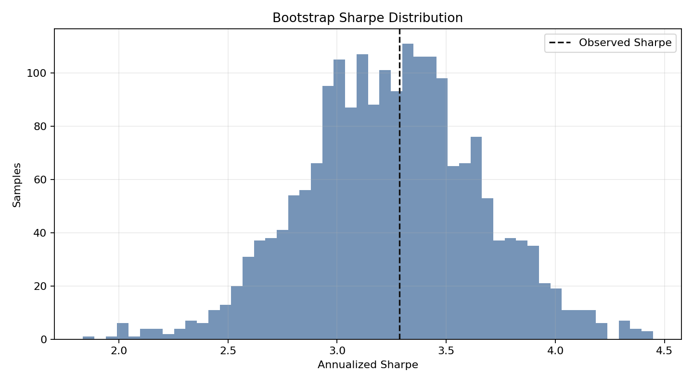
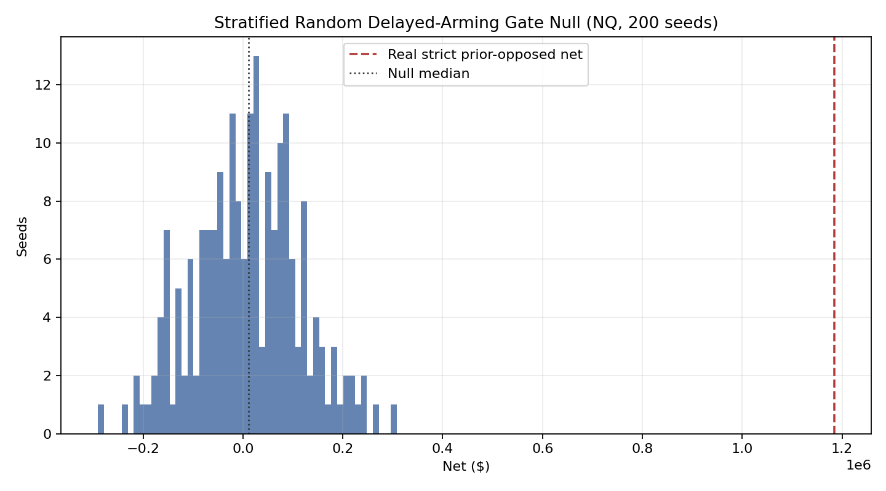
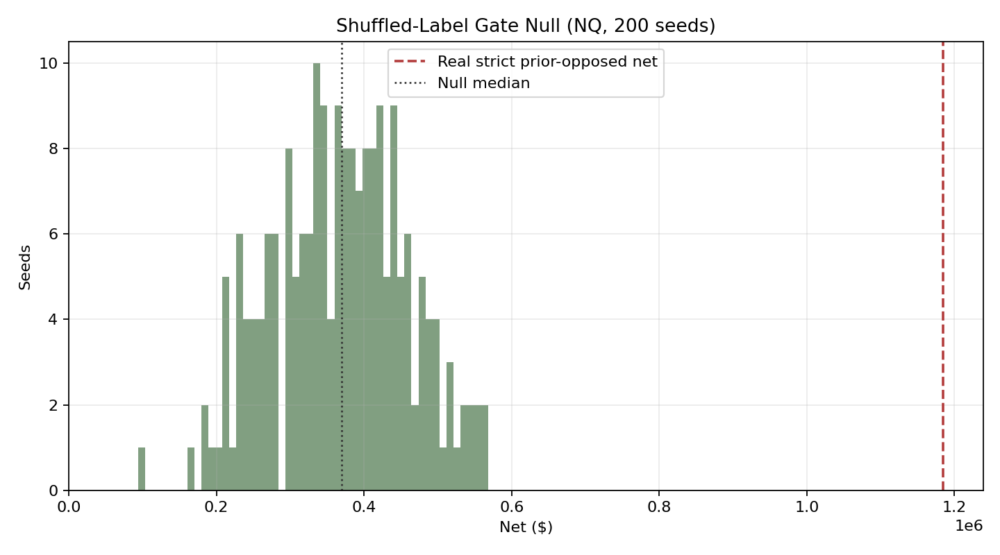
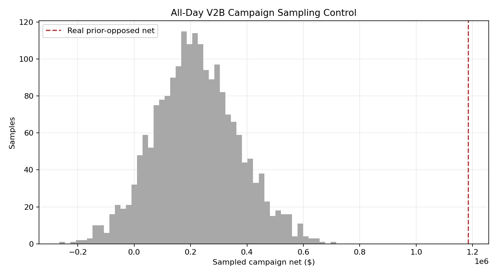
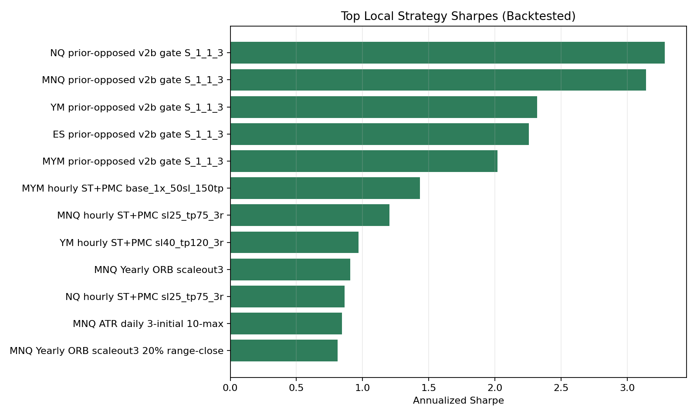

# Strategy Validation Scorecard

Generated: 2026-06-26T20:31:47Z

This report is **hypothetical/backtested and unaudited**. It is designed to make allocator diligence uncomfortable in the useful way: strong numbers are shown next to the data-quality limits and remaining overfit checks.

## What We Can Implement Now

| Area | Implemented now | Missing data | Left over |
| --- | --- | --- | --- |
| Peer comparison | Schema, source-tier rules, N-count guards, suppression warnings. | Sourced peer metric values and direct URLs/files for each manager. | Populate peer_comparison_table.csv from factsheets/databases, then enable z-scores and DSR_PEER_BENCHMARK. |
| DSR trial accounting | Backfilled ledger from 55 local strategy metric rows; N_eff=53.00. | Full historical analyst lab notebook for every old exploratory run. | Going forward, log every new run before review; optionally reconstruct older sweeps at finer granularity. |
| Random gate null | 200-seed stratified_fine_buckets on NQ/MNQ/YM/MYM and 200-seed shuffled_stpmc_side on NQ (both p=0.0050, two-family NQ exhibit). | Shuffled-label 200-seed on MNQ/YM/MYM; spec-aligned stratified_coarse_buckets NQ; ES 1m DBN; 2,000-seed resolution scale. | Queue cross-market shuffled 200-seed, then coarse-bucket NQ, then 2,000-seed stratified scale. |
| Execution truth | Scorecard carries tick-proof warning and links to execution scrutiny. | Tick reconstruction and broker-paper order/fill parity for same-minute/pre-arm-touch rows. | Run tick replay and Tradovate/CQG demo paper reconciliation before live funding claims. |
| Stress/Monte Carlo | Daily bootstrap Sharpe and equity/drawdown chart. | Block bootstrap, synthetic macro shock calibration, recovery-time scenario table. | Add final-report mode with 20k bootstrap paths and named historical/synthetic shocks. |

## Headline Candidate

**2026-07-16 promotion baseline:** resting-limit **hour-complete** — **$1,330,920 net / -$68,610 MTM / 19.40 Net/Stress** (432 campaigns). Lookahead re-review: SOLID. Institutional Sharpe/Calmar below are still from the legacy fill-stamp equity until regenerated.

| Metric | NQ prior-opposed (legacy fill stamp — diagnostic) |
|---|---:|
| Sharpe | 3.29 |
| Sortino | 4.80 |
| CAGR | 52.8% |
| Calmar | 1.58 |
| QQQ correlation | -0.11 |
| QQQ downside capture | -1.31 |
| Profit factor | 2.65 |

## Tier-1 Families (Phase 1b)

Equal validation scrutiny targets for non-v2b Tier-1 families. Gate nulls are v2b-only until Phase 1c.

### Yearly ORB (scaleout3)

Headline: **NQ Yearly ORB scaleout3** — Sharpe 0.72, CAGR 8.6%, net $850,314.

**Family-specific gate null:** not run (Phase 1c).

| Strategy | Instrument | Sharpe | Sortino | CAGR | Calmar | Net | PF |
| --- | --- | --- | --- | --- | --- | --- | --- |
| NQ Yearly ORB scaleout3 | NQ | 0.72 | 0.45 | 8.6% | 0.26 | $850,314 | 18.18 |
| MNQ Yearly ORB scaleout3 | MNQ | 0.91 | 0.63 | 18.1% | 0.54 | $67,942 | 32.63 |
| ES Yearly ORB scaleout3 | ES | 0.66 | 0.44 | 8.7% | 0.26 | $328,728 | 6.05 |
| YM Yearly ORB scaleout3 | YM | 0.64 | 0.35 | 8.0% | 0.24 | $288,757 | 13.93 |
| MYM Yearly ORB scaleout3 | MYM | 0.63 | 0.28 | 12.9% | 0.39 | $15,123 | 19.88 |

### ATR supertrend daily ladder (1/1/2/2/2 10-max)

Headline: **NQ ATR daily ladder 1/1/2/2/2 10-max** — Sharpe 0.55, CAGR 7.3%, net $1,572,142.

**Family-specific gate null:** not run (Phase 1c).

| Strategy | Instrument | Sharpe | Sortino | CAGR | Calmar | Net | PF |
| --- | --- | --- | --- | --- | --- | --- | --- |
| NQ ATR daily ladder 1/1/2/2/2 10-max | NQ | 0.55 | 0.44 | 7.3% | 0.22 | $1,572,142 | 3.41 |
| MNQ ATR daily ladder 1/1/2/2/2 10-max | MNQ | 0.80 | 0.65 | 16.9% | 0.51 | $146,875 | 4.54 |
| ES ATR daily ladder 1/1/2/2/2 10-max | ES | 0.32 | 0.27 | 3.1% | 0.09 | $448,400 | 1.76 |
| YM ATR daily ladder 1/1/2/2/2 10-max | YM | 0.09 | 0.07 | 0.9% | 0.03 | $101,693 | 1.19 |
| MYM ATR daily ladder 1/1/2/2/2 10-max | MYM | 0.04 | 0.03 | 0.6% | 0.02 | $2,366 | 1.08 |

## Trial Ledger / DSR (campaign-level primary)

- Ledger rows: 61
- Effective N: **53.00**
- Campaign Sharpe (annualized): **2.94**
- Campaign observations: 352
- PSR vs zero (campaign): **100.00%**
- DSR zero benchmark (campaign): **100.00%**
- DSR peer benchmark: **suppressed** until sourced peer Sharpe data exists.
- Campaign skew / kurtosis: 1.09 / 7.09
- Daily Sharpe (secondary exhibit): 3.29; daily PSR: 100.00%

Bootstrap Sharpe P5/P50/P95: **2.60 / 3.25 / 3.91**.

## Two-Family Permutation Nulls (NQ)

Two independent permutation families from the same `Engine + PaperBroker + v2b_scaleout` path. Real clears both: the edge requires the specific prior-opposed direction, not just timing or structure.

| Family | Controls for | NQ null median | NQ p(null>=real) |
| --- | --- | --- | --- |
| Stratified (`stratified_fine_buckets`) | year, side, time bucket, OR-width quartile | $11,756 | 0.0050 |
| Shuffled labels (`shuffled_stpmc_side`) | direction only (timing and count fixed) | $370,025 | 0.0050 |

**Stratified null** — random gates with identical structural characteristics do not reproduce the edge (rules out structural artifacts).

| Market | Seeds | Null Median | Null P95 | Real Strict | p(null>=real) | Violations |
| --- | --- | --- | --- | --- | --- | --- |
| NQ | 200 | $11,756 | $184,136 | $1,184,585 | 0.0050 | 0 |
| MNQ | 200 | $-231 | $16,138 | $113,548 | 0.0050 | 0 |
| YM | 200 | $-42,778 | $24,353 | $320,190 | 0.0050 | 0 |
| MYM | 200 | $-5,878 | $714 | $26,054 | 0.0050 | 0 |

**Shuffled-label null** — random direction with identical ST+PMC timing/count does not reproduce the edge (rules out timing-only artifacts). Null range $94,128–$568,650; real $1,184,585 sits above null p99.5 $560,879.

| Seeds | Null median | Null P5 | Null P95 | Null best | Real strict | p(null>=real) | Violations |
|---:|---:|---:|---:|---:|---:|---:|---:|
| 200 | $370,025 | $216,509 | $519,636 | $568,650 | $1,184,585 | 0.0050 | 0 |

Qualitative NQ edge decomposition (null families are **not orthogonal**; illustrative only):

| Component | Estimated contribution | Source |
| --- | --- | --- |
| Timing/structure alone (shuffled median) | $370,025 | Shuffled-label null |
| Gate placement precision within structure | $358,269 | Stratified p50 gap to shuffled p50 |
| Prior-opposed directional mechanic | $456,291 | Real minus timing and placement components |
| Total real | $1,184,585 | Strict prior-opposed replay |

The ~$370K timing/structure component reflects NQ positive trend carry over the 2021-03-04–2026-03-06 prior-opposed common replay window (full Engine+PaperBroker tape, not gate-event PnL in isolation); it is not portable structural alpha across regimes. The prior-opposed directional component is the portion that cannot be explained by market carry alone.

Artifact index: `live/state/v2b_prior_opposed_random_gate_replays/INDEX.md`.

## Secondary Sampling Control

Equal-count campaign sampling control used 352 campaigns sampled from 1386 all-day v2b campaigns over 2,000 iterations. Real net was $1,184,585; sampling median was $215,466 and P95 was $471,784. Real result percentile: 100.0; one-sided p-value for sampled net >= real net: 0.0005. This is supportive, but it is not a true randomized delayed-arming replay.

## Peer Data Guard

The peer table is seeded with 12 named CTA/managed-futures comparables, but all peer metrics are `NA` until direct source documents are collected. Therefore peer z-scores and `DSR_PEER_BENCHMARK` are intentionally suppressed.

## Local Strategy Context

| Strategy | Instrument | Sharpe | Sortino | CAGR | Calmar | QQQ Corr |
| --- | --- | --- | --- | --- | --- | --- |
| NQ prior-opposed v2b gate S_1_1_3 | NQ | 3.29 | 4.80 | 52.8% | 1.58 | -0.11 |
| MNQ prior-opposed v2b gate S_1_1_3 | MNQ | 3.14 | 4.58 | 51.5% | 1.54 | -0.11 |
| YM prior-opposed v2b gate S_1_1_3 | YM | 2.32 | 3.06 | 37.2% | 1.11 | -0.00 |
| ES prior-opposed v2b gate S_1_1_3 | ES | 2.26 | 2.51 | 35.1% | 1.05 | 0.04 |
| MYM prior-opposed v2b gate S_1_1_3 | MYM | 2.02 | 2.62 | 33.6% | 1.01 | -0.00 |
| MYM hourly ST+PMC base_1x_50sl_150tp | MYM | 1.43 | 3.45 | 14.2% | 0.43 | 0.03 |
| MNQ hourly ST+PMC sl25_tp75_3r | MNQ | 1.20 | 2.44 | 13.9% | 0.42 | 0.02 |
| YM hourly ST+PMC sl40_tp120_3r | YM | 0.97 | 1.93 | 6.3% | 0.19 | 0.00 |
| MNQ Yearly ORB scaleout3 | MNQ | 0.91 | 0.63 | 18.1% | 0.54 | -0.09 |
| NQ hourly ST+PMC sl25_tp75_3r | NQ | 0.86 | 1.42 | 7.1% | 0.21 | 0.01 |
| MNQ ATR daily 3-initial 10-max | MNQ | 0.84 | 0.73 | 16.3% | 0.49 | 0.43 |
| MNQ Yearly ORB scaleout3 20% range-close | MNQ | 0.81 | 0.71 | 14.8% | 0.44 | -0.01 |

## Warnings

- `DSR_PEER_BENCHMARK_SUPPRESSED: no sourced peer Sharpe values`
- `ALL_METRICS_NA_PEER: PEER_WINTON_01`
- `ALL_METRICS_NA_PEER: PEER_MAN_AHL_01`
- `ALL_METRICS_NA_PEER: PEER_ASPECT_01`
- `ALL_METRICS_NA_PEER: PEER_COVENANT_01`
- `ALL_METRICS_NA_PEER: PEER_QUANTICA_01`
- `ALL_METRICS_NA_PEER: PEER_AQR_01`
- `ALL_METRICS_NA_PEER: PEER_CAMPBELL_01`
- `ALL_METRICS_NA_PEER: PEER_TRANSTREND_01`
- `ALL_METRICS_NA_PEER: PEER_GRAHAM_01`
- `ALL_METRICS_NA_PEER: PEER_ALPHA_SIMPLEX_01`
- `ALL_METRICS_NA_PEER: PEER_ABRDN_01`
- `ALL_METRICS_NA_PEER: PEER_SG_TREND_01`
- `Z_SCORE_SUPPRESSED: metric=sharpe_ratio, N=0`
- `Z_SCORE_SUPPRESSED: metric=sortino_ratio, N=0`
- `Z_SCORE_SUPPRESSED: metric=cagr_pct, N=0`
- `Z_SCORE_SUPPRESSED: metric=calmar_ratio, N=0`
- `Z_SCORE_SUPPRESSED: metric=max_drawdown_pct, N=0`
