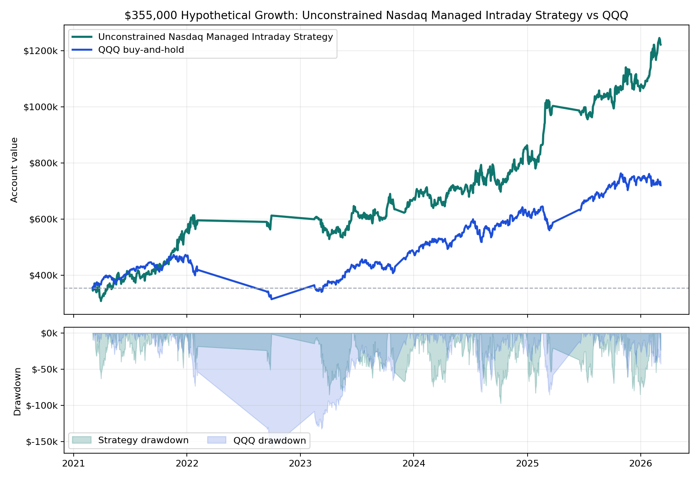

# Unconstrained Nasdaq Managed Intraday Strategy vs QQQ

**One-page hypothetical exhibit.** Starting capital is **$355,000** for both paths. The managed intraday sleeve uses a rules-based futures replay; QQQ uses adjusted-close buy-and-hold over the same available window.

## Headline

- **Unconstrained Nasdaq Managed Intraday Strategy:** $1,222,387.50 ending value, $867,387.50 net, **244.3% total return**.
- **QQQ buy-and-hold:** $721,470.91 ending value, $366,470.91 net, **103.2% total return**.
- Strategy max daily drawdown on this account path: **27.4%**.
- Worst annual QQQ daily drawdown as a share of that year's starting balance: **33.5%**.

## Institutional Metrics

| Metric | Managed intraday sleeve |
|---|---:|
| Pitch window | 2021-03-04 to 2026-03-06 |
| Account-path CAGR | 28.0% |
| Sharpe / Sortino | 1.34 / 2.07 |
| Calmar on account drawdown | 1.02 |
| Net / modeled stress DD | 8.96 |
| Max drawdown duration | 505 days |
| Daily skew | -0.10 |
| QQQ corr / downside capture | -0.07 / -0.19 |
| Profit factor / campaign win rate | 1.19 / 53.8% |
| Campaigns | 1,386 |
| Modeled stress DD | $-96,807 |

## Annual Table

| Year | Strategy Start | Strategy Net | Strategy Return | Strategy DD % | QQQ Start | QQQ Net | QQQ Return | QQQ DD % |
|---:|---:|---:|---:|---:|---:|---:|---:|---:|
| 2021 | $355,000 | $209,262 | **58.9%** | 17.7% | $355,000 | $111,679 | **31.5%** | 9.6% |
| 2022 | $564,262 | $48,922 | **8.7%** | 9.0% | $466,679 | $-151,626 | **-32.5%** | 33.5% |
| 2023 | $613,184 | $56,956 | **9.3%** | 12.9% | $315,053 | $172,199 | **54.7%** | 15.6% |
| 2024 | $670,140 | $193,432 | **28.9%** | 14.5% | $487,252 | $124,631 | **25.6%** | 16.7% |
| 2025 | $863,571 | $207,028 | **24.0%** | 9.8% | $611,882 | $127,104 | **20.8%** | 13.9% |
| 2026 | $1,070,599 | $151,788 | **14.2%** | 5.1% | $738,986 | $-17,515 | **-2.4%** | 5.9% |

## Read

This is positioned as a **unconstrained intraday breakout sleeve**. It is not the flagship gated product; it is a complementary sleeve that may be easier to explain once live broker-paper parity is proven.

**Important caveat:** this remains hypothetical/backtested performance. The strategy still needs tick/order-sequence proof and broker-paper parity before live capital decisions.

## Internal Sources

- Equity curve: `live/state/v2b_sizing_sweep/states/nq_v2b_sizing_S_1_1_3/equity_curve.csv`
- Campaign fills: `live/state/v2b_sizing_sweep/states/nq_v2b_sizing_S_1_1_3/unit_trades.csv`
- Summary source: `live/state/v2b_sizing_sweep/summary_partial.csv`
