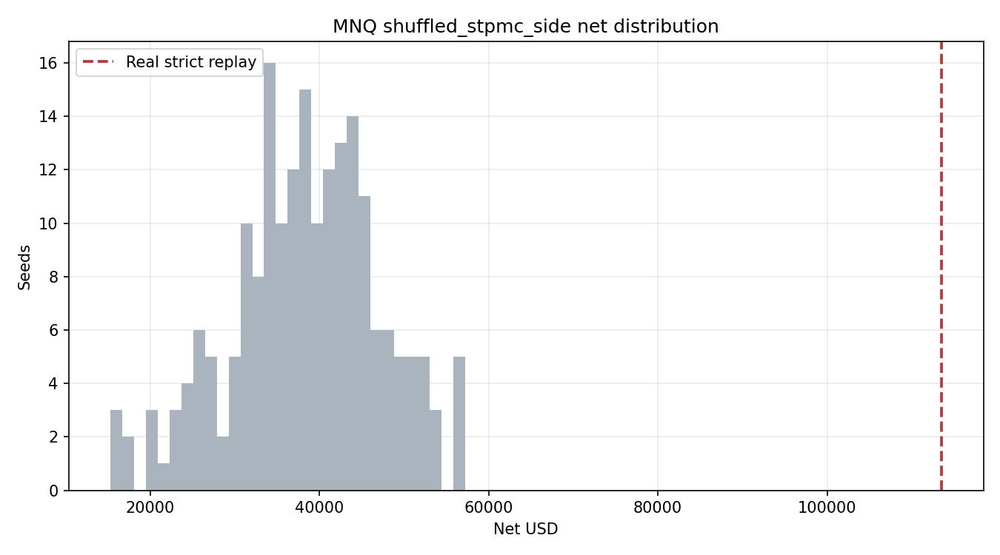

# MNQ shuffled_stpmc_side Random Delayed-Gate Replay

True `Engine + PaperBroker + StrategyPlugin` random delayed-arming replay. Strategy rules and broker realism are unchanged; only `dynamic_sizing_events` is randomized.

| Seeds | Real gate events | Median net | P5 net | P95 net | Median fills | Real net | Real fills | Real net percentile | p(null >= real) |
|---:|---:|---:|---:|---:|---:|---:|---:|---:|---:|
| 200 | 331 | $38638.25 | $23255.12 | $52308.47 | 173.5 | $113547.50 | 353 | 100.0 | 0.0050 |

Allocator-grade note: this report has 200+ random seeds; the p-value is suitable as a first null estimate.

Files:

- `summary_by_seed.csv`
- `null_distribution.csv`
- generated events under `../../generated_events/mnq/shuffled_stpmc_side/`
