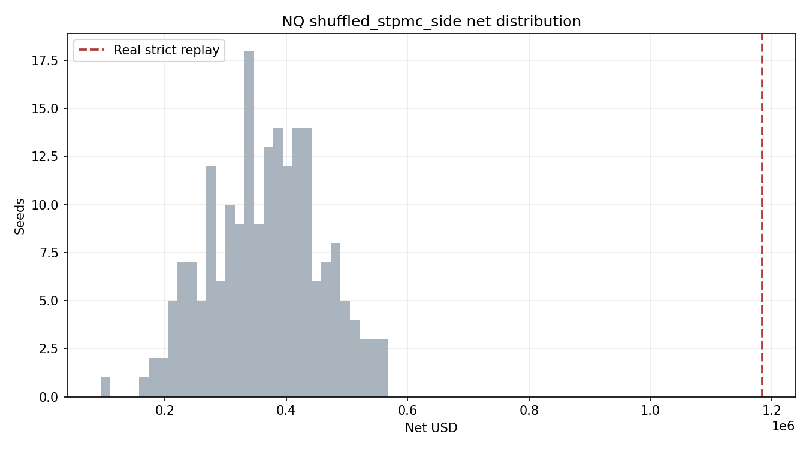

# NQ shuffled_stpmc_side Random Delayed-Gate Replay

True `Engine + PaperBroker + StrategyPlugin` random delayed-arming replay. Strategy rules and broker realism are unchanged; only `dynamic_sizing_events` is randomized.

| Seeds | Real gate events | Median net | P5 net | P95 net | Median fills | Real net | Real fills | Real net percentile | p(null >= real) |
|---:|---:|---:|---:|---:|---:|---:|---:|---:|---:|
| 200 | 332 | $370025.00 | $216508.88 | $519635.50 | 173.0 | $1184585.00 | 352 | 100.0 | 0.0050 |

Allocator-grade note: this report has 200+ random seeds; the p-value is suitable as a first null estimate.

Files:

- `summary_by_seed.csv`
- `null_distribution.csv`
- `run_metadata.json` (`seed_hash_source=null_replay_guard_batch_start`)
- generated events under `../../generated_events/nq/shuffled_stpmc_side/`

## Interpretation (two-family context)

This null **shuffles ST+PMC side labels** while preserving timing and gate-event count. It is complementary to the stratified null (`stratified_fine_buckets`), which randomizes gate placement within matched strata.

| Metric | Shuffled-label (this run) | Stratified (NQ, 200 seeds) |
|---|---:|---:|
| Null median net | $370,025 | $11,756 |
| Null P5 / P95 | $216,509 / $519,636 | -$164,912 / $184,136 |
| Real strict net | $1,184,585 | $1,184,585 |
| p(null >= real) | 0.0050 | 0.0050 |

The **non-zero shuffled median is expected**: ST+PMC timing/count structure alone captures substantial PnL on the **2021-03-04–2026-03-06** prior-opposed common replay window. That ~$370K timing/structure component reflects NQ positive trend carry over this period (full Engine+PaperBroker tape, not gate-event PnL in isolation); it is not portable structural alpha across regimes. The prior-opposed directional component is the portion not explained by market carry alone. Real still clears the entire shuffled distribution (above null p99.5 ~$569K).

**Qualitative edge decomposition (null families not orthogonal):**

| Component | ~Contribution | Source |
|---|---:|---|
| Timing/structure alone | $370K | Shuffled median |
| Gate placement within structure | $358K | Shuffled p50 − stratified p50 |
| Prior-opposed directional mechanic | $457K | Real − timing − placement |
| **Total real** | **$1,184,585** | Strict replay |

Ledger: `TRL-2026-00061` (`gate_null_shuffled_stpmc_side_nq`). `seed_hash=45685ee918ec80b8` matches stratified runs — same seed integers 1–200, different null method (documented in ledger `parameters_json`).
