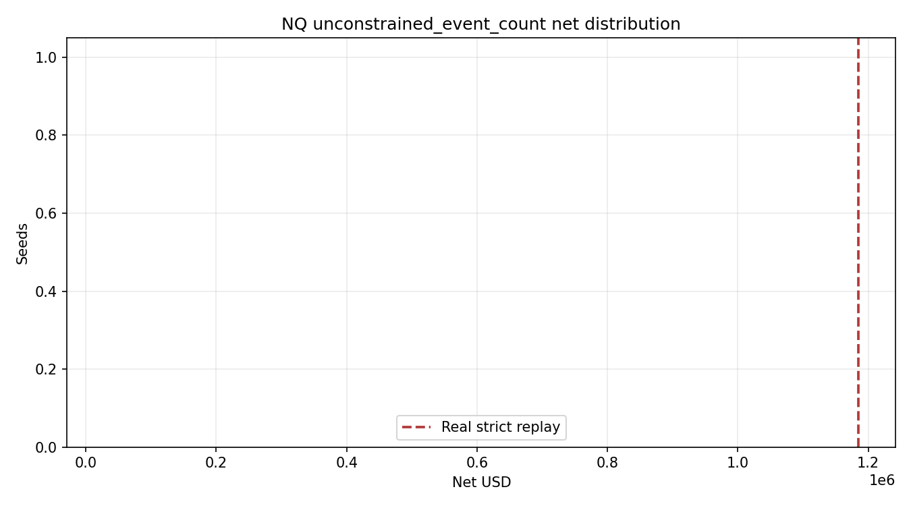

# NQ unconstrained_event_count Random Delayed-Gate Replay

True `Engine + PaperBroker + StrategyPlugin` random delayed-arming replay. Strategy rules and broker realism are unchanged; only `dynamic_sizing_events` is randomized.

| Seeds | Real gate events | Median net | P5 net | P95 net | Median fills | Real net | Real fills | Real net percentile | p(null >= real) |
|---:|---:|---:|---:|---:|---:|---:|---:|---:|---:|
| 1 | 332 | $28946.25 | $28946.25 | $28946.25 | 137.0 | $1184585.00 | 352 | 100.0 | 0.5000 |

Small-sample note: p-values are directional only until the planned 200+ seed batches are run.

Files:

- `summary_by_seed.csv`
- `null_distribution.csv`
- generated events under `../../generated_events/nq/unconstrained_event_count/`
