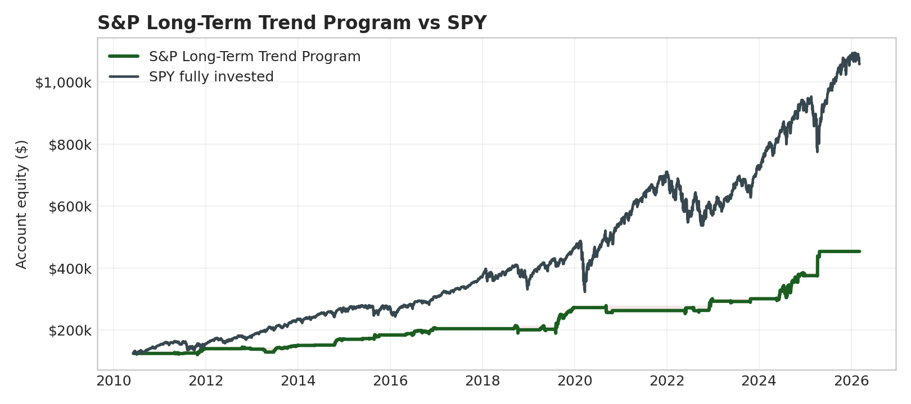

# S&P Long-Term Trend Program

**Status:** hypothetical/backtested broker-like replay. Not audited live performance.

| Metric | Value |
|---|---:|
| Starting account anchor | $125,000 |
| Net profit | $328,728 |
| Total return | 263.0% |
| CAGR | 8.5% |
| Intrabar stress DD | -$40,403 |
| Net / stress DD | 8.14 |
| Sharpe / Sortino | 0.73 / 0.45 |
| Calmar | 0.26 |
| Correlation to SPY | 0.06 |
| Profit factor / win rate | 6.19 / 75.3% |

## Annual Table

|   Year |   Program % |   ETF % |   Program net |   Program DD % |
|-------:|------------:|--------:|--------------:|---------------:|
| 2010.0 |         0.0 |    21.0 |           0.0 |            0.0 |
| 2011.0 |        12.3 |     1.9 |       15329.0 |            7.2 |
| 2012.0 |        -1.1 |    16.0 |       -1585.0 |            5.1 |
| 2013.0 |         9.1 |    32.3 |       12586.6 |            6.8 |
| 2014.0 |        13.4 |    13.5 |       20267.8 |            3.6 |
| 2015.0 |         7.5 |     1.2 |       12789.2 |            4.3 |
| 2016.0 |        10.7 |    12.0 |       19650.0 |            5.7 |
| 2017.0 |         0.3 |    21.7 |         697.0 |            0.1 |
| 2018.0 |        -1.9 |    -4.6 |       -3796.5 |           12.0 |
| 2019.0 |        35.7 |    31.2 |       71785.8 |           12.0 |
| 2020.0 |        -3.5 |    18.3 |       -9616.5 |            8.4 |
| 2021.0 |         0.0 |    28.7 |           0.0 |            0.0 |
| 2022.0 |        12.5 |   -18.2 |       32857.2 |            5.7 |
| 2023.0 |         1.8 |    26.2 |        5316.5 |            2.6 |
| 2024.0 |        24.5 |    24.9 |       73866.5 |           12.9 |
| 2025.0 |        20.9 |    17.7 |       78580.1 |            0.8 |
| 2026.0 |         0.0 |    -1.4 |           0.0 |            0.0 |

PDF: `LONG_TERM_TREND_ES_SPY.pdf`
