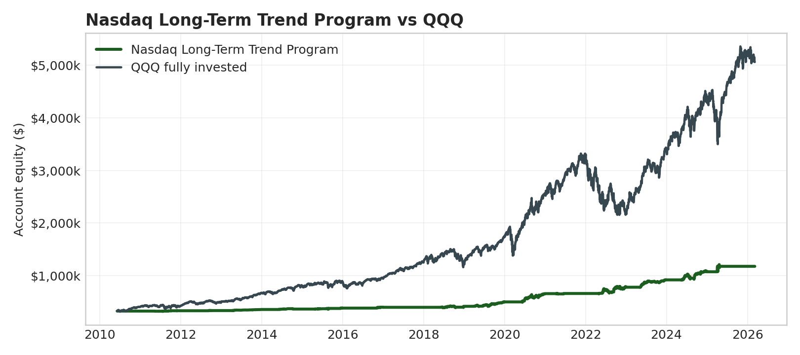

# Nasdaq Long-Term Trend Program

**Status:** hypothetical/backtested broker-like replay. Not audited live performance.

| Metric | Value |
|---|---:|
| Starting account anchor | $325,000 |
| Net profit | $850,314 |
| Total return | 261.6% |
| CAGR | 8.5% |
| Intrabar stress DD | -$106,720 |
| Net / stress DD | 7.97 |
| Sharpe / Sortino | 0.86 / 0.59 |
| Calmar | 0.26 |
| Correlation to QQQ | 0.04 |
| Profit factor / win rate | 22.69 / 85.3% |

## Annual Table

|   Year |   Program % |   ETF % |   Program net |   Program DD % |
|-------:|------------:|--------:|--------------:|---------------:|
| 2010.0 |         0.0 |    24.0 |           0.0 |            0.0 |
| 2011.0 |         1.9 |     3.5 |        6014.5 |            1.9 |
| 2012.0 |         1.0 |    18.1 |        3237.0 |            1.4 |
| 2013.0 |         6.3 |    36.6 |       20895.5 |            1.0 |
| 2014.0 |         2.2 |    19.2 |        7846.5 |            2.0 |
| 2015.0 |         5.1 |     9.4 |       18361.2 |            4.3 |
| 2016.0 |         3.7 |     7.1 |       14118.5 |            1.7 |
| 2017.0 |         0.1 |    32.7 |         567.0 |            0.1 |
| 2018.0 |         4.7 |    -0.1 |       18600.0 |            7.9 |
| 2019.0 |        20.3 |    39.0 |       84018.5 |            7.5 |
| 2020.0 |        31.6 |    48.4 |      157740.8 |           13.4 |
| 2021.0 |         0.4 |    27.4 |        2690.5 |            2.0 |
| 2022.0 |        18.5 |   -32.6 |      122116.0 |           12.8 |
| 2023.0 |        17.5 |    54.9 |      136432.5 |            4.3 |
| 2024.0 |        16.8 |    25.6 |      153780.5 |           10.7 |
| 2025.0 |         9.7 |    20.8 |      103895.0 |            9.7 |
| 2026.0 |         0.0 |    -2.4 |           0.0 |            0.0 |

PDF: `LONG_TERM_TREND_NQ_QQQ.pdf`
