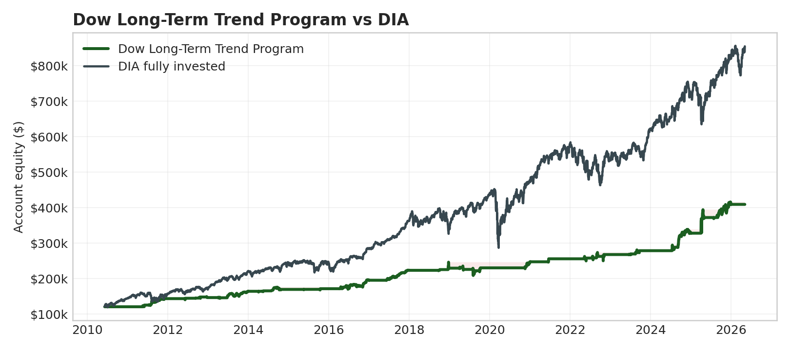

# Dow Long-Term Trend Program

**Status:** hypothetical/backtested broker-like replay. Not audited live performance.

| Metric | Value |
|---|---:|
| Starting account anchor | $120,000 |
| Net profit | $288,757 |
| Total return | 240.6% |
| CAGR | 8.0% |
| Intrabar stress DD | -$39,810 |
| Net / stress DD | 7.25 |
| Sharpe / Sortino | 0.78 / 0.45 |
| Calmar | 0.24 |
| Correlation to DIA | -0.02 |
| Profit factor / win rate | 15.26 / 90.1% |

## Annual Table

|   Year |   Program % |   ETF % |   Program net |   Program DD % |
|-------:|------------:|--------:|--------------:|---------------:|
| 2010.0 |         0.0 |    19.7 |           0.0 |            0.0 |
| 2011.0 |        19.1 |     8.1 |       22974.5 |            5.3 |
| 2012.0 |         2.1 |     9.9 |        2944.5 |            2.7 |
| 2013.0 |        12.4 |    29.6 |       18027.2 |            5.9 |
| 2014.0 |         3.0 |     9.7 |        4991.5 |            4.8 |
| 2015.0 |         1.2 |     0.1 |        1992.0 |            1.2 |
| 2016.0 |        13.7 |    16.4 |       23333.2 |            6.1 |
| 2017.0 |        14.5 |    28.1 |       28248.8 |            2.0 |
| 2018.0 |         2.9 |    -3.7 |        6415.0 |            7.7 |
| 2019.0 |         0.4 |    25.0 |         820.5 |           11.7 |
| 2020.0 |         7.5 |     9.6 |       17170.5 |            2.4 |
| 2021.0 |         3.4 |    20.8 |        8391.0 |            0.5 |
| 2022.0 |         4.7 |    -7.0 |       11994.2 |            9.2 |
| 2023.0 |         4.1 |    16.0 |       10903.5 |            3.0 |
| 2024.0 |        17.6 |    14.8 |       49039.8 |            4.9 |
| 2025.0 |        24.8 |    14.7 |       81303.5 |           12.1 |
| 2026.0 |         0.1 |     4.3 |         207.0 |            0.1 |

PDF: `LONG_TERM_TREND_YM_DIA.pdf`
