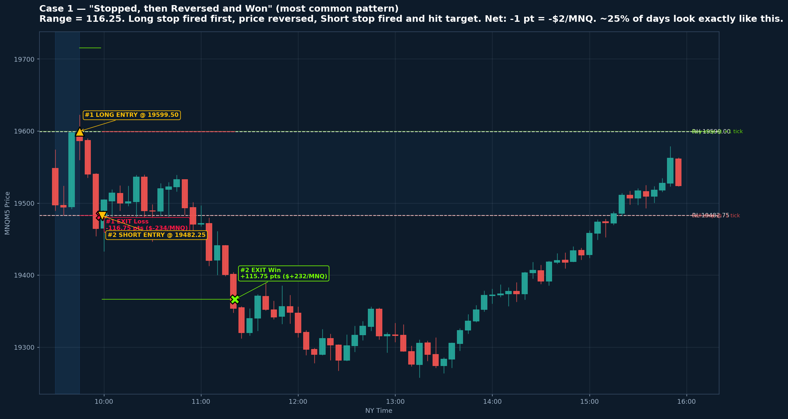
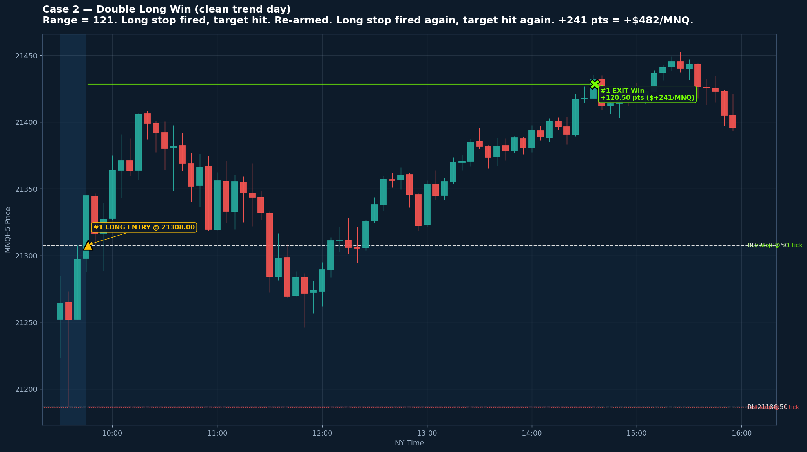
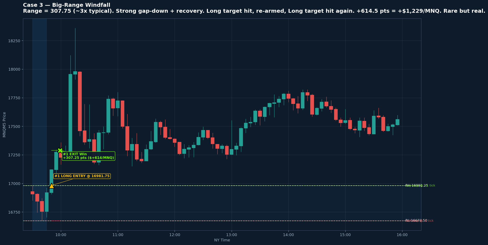
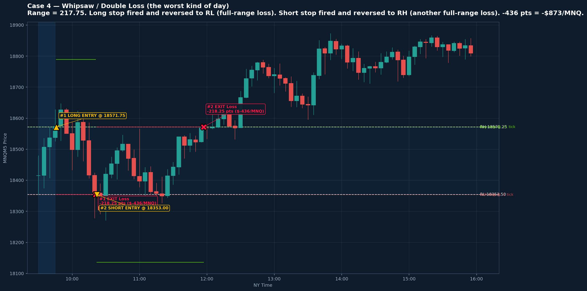
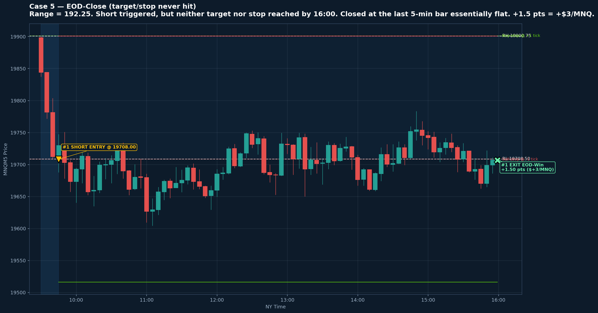
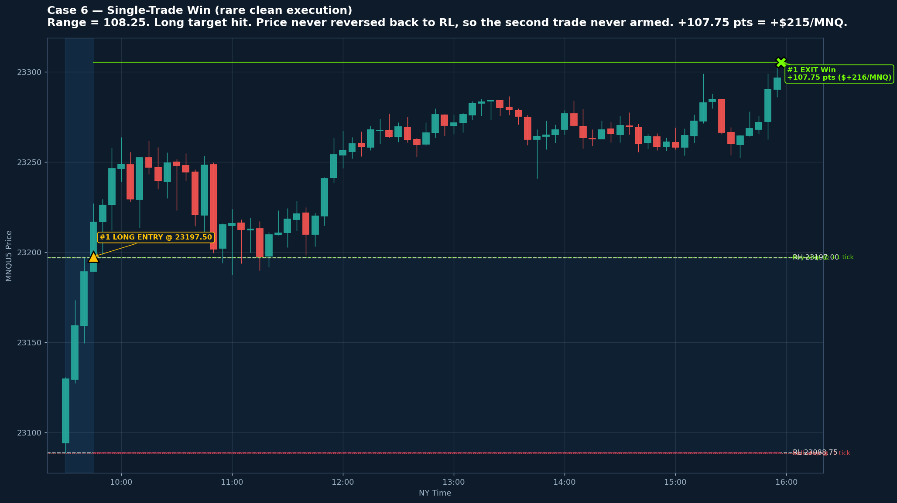

# v2 ORB — Real Trading-Day Case Studies

> **Strategy tracker:** Execution variants (step2 canon, open‑limit fork, `v2b_child`, swept ladder, adaptive 50/150) with rules links and performance snapshots live in **[`STRATEGY_TRACKER.md`](STRATEGY_TRACKER.md)**.

> **v2e (London limit research):** London-sweep PNGs, v2e sim scripts, and `mnq_v2e_per_leg.csv` live under **`../v2e/`** (`../v2e/README.md`). **Scope:** those charts use **causal** 02:00–09:30 Ldn H/L from 1m for prices, but the **day subset** is still chosen by **`Opp_sweep_London_*`** flags from the annotator (older 02:00–**11:00**-style research context on the same row). They illustrate v2e on a **curated** subset, not a fully **live-selectable** screen. This folder is otherwise the **v2b** 5m case-study chart suite.

> **2026-04-25 update**: Charts have been regenerated against the
> corrected **v2b** backtest (bracket-then-reverse). The `random_samples/`
> charts have NOT been regenerated and reflect the previous **v2a**
> data (with the same-direction re-entry bug). Re-run
> `build_random_samples.py` to refresh them.
>
> Some case-study titles below (Cases 2 and 3) describe "double win"
> patterns that v2a generated but v2b does not. With v2b, those days
> are usually single-trade wins. The charts now reflect single-trade
> reality; the prose will be updated when time permits.
>
> See `../scripts/validation.md` for the full v2a→v2b correction
> story and honest performance numbers.

Six annotated case studies built from the v2 backtest CSV
(`../mnq/mnq_orb_results_stops.csv`). Each chart shows real 5-min
candles for the day, the actual range/trigger/target/stop levels,
and where the live system would have entered and exited.

## Why these matter

The v2 model uses **pre-placed OCO stop entries** at `RH + 1 tick` and
`RL - 1 tick` armed at 9:45 ET. This makes it faster than the v1
close-based limit model — but it also means the system fills on the
**first intrabar tick through the level**, including fake breakouts
that v1 would have ignored. These case studies show what that actually
costs and gains in real trading days.

## How often does each pattern happen?

Computed across **1,325 trading days** (MNQ NY session, 2021-03-04 →
2026-04-23):

| Pattern | Days | % of days | Avg $/MNQ |
|---|---|---|---|
| **Double Win** (trend day) | 625 | **47.2%** | **+$336** |
| Loss-then-Win (mean-revert pair) | 232 | 17.5% | −$2 |
| **Double Loss** (whipsaw) | 196 | **14.8%** | **−$340** |
| Single-trade EOD-Close | 132 | 10.0% | +$11 |
| EOD-Close (combined with one trade) | 114 | 8.6% | −$186 |
| Other (one trade + no second arm, etc.) | 26 | 2.0% | −$72 |
| Single-trade Win | 4 | 0.3% | +$158 |
| Single-trade Loss | 3 | 0.2% | −$195 |

**Read this carefully:**
- **About one in two days is a clean trend day** averaging +$336/MNQ.
- **About one in seven days is a whipsaw** averaging −$340/MNQ.
- These two cancel out in raw count, but the trend days produce slightly
  more dollars per day, giving the strategy its long-run edge.
- **Loss-then-Win is essentially flat** (−$2/MNQ avg) — these days look
  scary mid-day but finish unchanged. ~18% of days look like this.
- **EOD-Close days** are the wild card: roughly half the time you're
  flat-ish, the other half you're holding an open trade into a bad
  close.

## Worst and best single days in the 5-yr backtest

| | Date | Pattern | Pts | $/MNQ |
|---|---|---|---|---|
| Worst #1 | 2025-11-17 | Long Loss → Short Loss | −489 | **−$978** |
| Worst #2 | 2022-11-04 | Short Loss → Long Loss | −449.5 | −$899 |
| Worst #3 | **2025-04-11** | Long Loss → Short Loss | −436.5 | **−$873 (Case 4)** |
| Best #1 | 2024-08-05 | Long Win → Long Win | +723.5 | **+$1,447** |
| Best #2 | 2025-04-09 | Long Win → Long Win | +714 | +$1,428 |
| Best #3 | **2025-04-07** | Long Win → Long Win | +614.5 | **+$1,229 (Case 3)** |

The worst single day is roughly equal in magnitude to the best —
a property of pre-placed stops with 1R targets. Position sizing must
respect that **±$1,000/MNQ** is the realistic single-day envelope.

---

## Case 1 — "Stopped, then Reversed and Won" (the most common pattern)

**Date:** 2025-04-28 | **Symbol:** MNQM5 | **Range:** 116.25 pts



**What happened:**
1. Range built between 19,482.75 and 19,599.00 from 9:30-9:45.
2. Buy-stop armed at 19,599.50; sell-stop armed at 19,482.50.
3. **9:55** — price spiked above 19,599.25, triggered the buy-stop. Entry at **19,599.50**.
4. Price reversed almost immediately. Hit the stop at **19,482.75 (RL)**. **Loss of -116.75 pts (-$233)**.
5. Sell-stop re-armed automatically. Triggered at **19,482.25**.
6. **11:30** — price hit target at **19,366.50 (RL - Range)**. **Win of +115.75 pts (+$232)**.
7. **Net for the day: -1.0 pt = -$2/MNQ** (essentially break-even after the round-trip stops eat each other; the $1.50 fee on each trade adds up to the −$2).

**The lesson:**
This is the **single most common non-trivial day type** (~17.5% of all
days). Mid-day equity dips ~$233 below the morning's open, then
recovers all the way back. If you watch the screen at 10:00 AM you'll
think the strategy is broken; by lunch you're flat. **Most "scary
moments" in live trading look like this and resolve fine by close.**

---

## Case 2 — Double Long Win (clean trend day, the bread and butter)

**Date:** 2025-01-15 | **Symbol:** MNQH5 | **Range:** 121 pts



**What happened:**
1. Tight 121-point range from 9:30-9:45.
2. Buy-stop fired around 10:00. Entry at **RH + 1 tick**.
3. Steady rally. Long target hit ~11:30. **Win #1: +120.5 pts (+$241)**.
4. System re-armed both stops.
5. Another buy-stop fired in the afternoon. Entry at the same level.
6. Rallied again to a second target. **Win #2: +120.5 pts (+$241)**.
7. **Net: +241 pts = +$482/MNQ** (the day's max trade cap of 2 hit).

**The lesson:**
Trend days like this are **47% of all days** in the backtest. The
strategy was specifically designed to compound on these. Most of the
strategy's $117k 5-yr P/L comes from just these days. They tend to
cluster — when you have one, the next day is also more likely to trend
(macro regime persistence).

---

## Case 3 — Big-Range Windfall (the rare 3% of days)

**Date:** 2025-04-07 | **Symbol:** MNQM5 | **Range:** 307.75 pts (~3× typical)



**What happened:**
1. Massive overnight gap created a 307.75-point opening range.
2. Buy-stop triggered with strong momentum.
3. Target = entry + 307.75 pts hit cleanly. **Win #1: +307.25 pts (+$614)**.
4. Re-armed; buy-stop triggered again on continuation. **Win #2: +307.25 pts (+$614)**.
5. **Net: +614.5 pts = +$1,229/MNQ** in a single session.

**The lesson:**
Days like this happen ~3-5x per year (typically around macro events:
FOMC, NFP surprises, geopolitical shocks). They aren't predictable but
they're a real tail. **The strategy doesn't filter wide-range days —
they just produce bigger swings in both directions.** See Case 4 for
the flip side: a wide range can also give you a $873 loss.

---

## Case 4 — Whipsaw / Double Loss (the worst kind of day)

**Date:** 2025-04-11 | **Symbol:** MNQM5 | **Range:** 217.75 pts



**What happened:**
1. Wide 217.75-point opening range — already a warning sign of choppy conditions.
2. Buy-stop fired first. Entry at **RH + 1 tick**.
3. Price reversed across the entire range. Hit the stop at **RL**. **Loss #1: -218.25 pts (-$436)**.
4. Sell-stop re-armed and triggered immediately on the same move.
5. Price reversed AGAIN, all the way back across the range to RH. **Loss #2: -218.25 pts (-$436)**.
6. **Net: -436 pts = -$873/MNQ** in a single session.

**The lesson:**
This is the **worst routine outcome** for the strategy. ~14.8% of days
look like this — over a year that's roughly **35-40 days**. The day
can lose more than a typical good week makes. **Account sizing must
explicitly survive 2-3 of these in a row.** Our $5,000 minimum at 1
MNQ is sized so that even three consecutive worst-case days
(-$873 × 3 = -$2,619) leaves the account above the $2,100 overnight
margin requirement.

**Why does it happen?**
Wide ranges produce wide breakouts in both directions — every move
through the range looks like a real signal but is actually mean
reversion. There's no profitable filter in the backtest that excludes
these days while keeping the trend days (we tested range-size,
day-of-week, prior-day filters; none beat the unfiltered version).

---

## Case 5 — EOD-Close (target/stop never hit)

**Date:** 2025-03-18 | **Symbol:** MNQM5 | **Range:** 192.25 pts



**What happened:**
1. Wide 192-point opening range.
2. Sell-stop fired in the morning. Entry at **RL - 1 tick**.
3. Price drifted sideways for the rest of the day — never returning to the
   stop and never reaching the target.
4. At 15:55, force-close fired. Exit at **last 5-min bar's close**.
5. Tiny win: +1.5 pts = +$3/MNQ.

**The lesson:**
About **18% of trades end this way** — neither a winner nor a loser,
just a position that ran out of session time. The P/L can land
anywhere in the range; on average it's slightly negative
(see "EOD-Close combined" row above: −$186/MNQ avg) because
when you're underwater at 16:00 you tend to be deeper than when you're
ahead. **In live trading, expect about 1 EOD-Close trade per week.**
They're emotionally annoying (no clean resolution) but financially
small.

---

## Case 6 — Single-Trade Win (rare clean execution)

**Date:** 2025-08-04 | **Symbol:** MNQU5 | **Range:** 108.25 pts



**What happened:**
1. Standard 108-point opening range.
2. Long stop fired in the morning.
3. Target hit cleanly.
4. System re-armed — but price never returned anywhere near the
   opposite range boundary, so the second trade never triggered.
5. **Net: +107.75 pts = +$215/MNQ** from a single clean trade.

**The lesson:**
Single-trade Win days are **rare (~0.3% = ~1 day/year)**. This happens
when the first move is so decisive that price never retraces enough to
fire the opposite stop. Note the irony: you might think this is the
"best" day, but it actually leaves money on the table compared to a
double-win trend day. The bread-and-butter trend days (Case 2) make 2×
this amount.

---

## Risk takeaways for paper-trading and live deployment

### Mid-day emotion checklist

When you're watching the strategy live, here's what to expect:

| If you see... | It probably is... | Action |
|---|---|---|
| First trade stopped out, price reversing | Loss-then-Win pattern (17.5%) | Wait. Re-arm is automatic. ~50% recover by close. |
| Both trades stopped out before noon | Whipsaw day (14.8%) | Done for the day. No third trade. Accept the loss. |
| First trade hit target by 11:00 | Trend day (47%) | Likely a second trade comes. Don't interfere. |
| Position open at 14:00 with no exit hit | EOD-Close day (18%) | Will close at 15:55. Outcome random. |

### Expected weekly P/L distribution (1 MNQ, 5 trading days)

Using the daily averages weighted by frequency:

- **Best week realistically expected**: ~$1,500-2,500 (3-4 trend days)
- **Median week**: ~$300-700 (mix of trends, whipsaws, mean-reverters)
- **Bad week**: −$500 to −$1,500 (2+ whipsaws + EOD losses)
- **Worst week realistically possible**: −$2,000 to −$3,000 (multiple
  consecutive whipsaws — happens once every 2-3 years)

### Risk-management implications

1. **Don't intervene mid-trade.** Most "obviously losing" trades at
   10:00 AM (Case 1) end break-even or better by 13:00. The system has
   been validated to not need discretion.
2. **Don't add size after a winning week.** The next week could easily
   be Case 4 territory.
3. **Don't reduce size after a losing week.** Same reason — the next
   week could be Case 3 territory. Size is set by the account balance,
   not recent performance.
4. **Account for 3 consecutive worst-case days.** −$2,619/MNQ buffer
   above margin = $2,100 IM + $2,619 = ~$4,800 minimum (we recommend
   $5,000 for 1 MNQ, $8,000 for the 4-strategy 1×1×1×1 portfolio).

---

## Per-year samples (100 days/year, 579 charts total)

Located in `by_year/<year>/`. **Use these for comparing how the strategy
behaved across regimes** — particularly the flat 2022/2023 years vs the
strong 2021/2024/2025/2026 years. See `by_year/SUMMARY.md` for the
year-over-year P/L table.

| Year | Sample | Full-year Net $/MNQ | Win % | Worst day |
|---|---|---|---|---|
| [2021](by_year/2021/INDEX.md) | 100 | **+$2,992** | 56.3% | −$768 |
| [2022](by_year/2022/INDEX.md) | 100 | **−$458** (flat) | 52.4% | −$899 |
| [2023](by_year/2023/INDEX.md) | 100 | **+$12** (flat) | 51.3% | −$530 |
| [2024](by_year/2024/INDEX.md) | 100 | **+$3,516** | 55.1% | −$595 |
| [2025](by_year/2025/INDEX.md) | 100 | **+$5,029** | 54.1% | −$978 |
| [2026](by_year/2026/INDEX.md) | 79 | **+$4,786** | 58.8% (YTD) | −$582 |

Each year folder contains an `INDEX.md` with a sortable table of
date / pattern / P/L for every sampled day, plus thumbnails of all
sampled charts.

Run `python case_studies/build_year_samples.py` to regenerate.

## Adaptive 50/150 — per-year samples (**v2b + v2d**)

Separate from raw v2b: charts use `mnq/v2d/mnq_orb_results_adaptive_50_150.csv`
so each day is labeled **v2b** (OCO stop breakout) or **v2d** (fade), matching
the prior-day 50/150 regime. Titles include prior MA snapshot; v2d days
show extra trigger guides (fade stop levels).

| Location | Contents |
|---|---|
| [`adaptive_by_year/SUMMARY.md`](adaptive_by_year/SUMMARY.md) | Year table with **v2b-day vs v2d-day counts** |
| [`adaptive_by_year/<year>/INDEX.md`](adaptive_by_year/2022/INDEX.md) | 100 sampled days (46 in 2026 YTD) + links to PNGs |

Regenerate (default 100 days/year, seed 42):

```bash
cd /home/tester/hsm/potions
python mnq/v2d/build_adaptive_year_samples.py
python mnq/v2d/build_adaptive_year_samples.py -n 50 --seed 7
```

## Random sample of 44 additional days

For broader cross-year confidence, a randomly-sampled set of 44 days
from 2024-01-01 onwards has been generated in `random_samples/`. Each
chart uses the same annotation style as the six curated cases above.

**Sample summary** (seed=42):

| Category | Count | % | Population % |
|---|---|---|---|
| Double Win | 23 | 52.3% | 47.2% |
| Loss-then-Win | 8 | 18.2% | 17.5% |
| Double Loss | 6 | 13.6% | 14.8% |
| EOD-Close | 5 | 11.4% | ~18% |
| Other | 2 | 4.5% | ~2% |

**44 days, 25 green (56.8%), net +$5,664/MNQ** across the sample
window — a slightly above-average stretch but within normal sampling
variance (long-run avg is ~$92/day). The category mix tracks the
population almost exactly.

See `random_samples/INDEX.md` for the day-by-day table and links to
each chart.

## Reproduce

```bash
cd /home/tester/hsm/potions

# Curated 6 case studies (the ones embedded in this doc)
python case_studies/build_case_studies.py

# 44 random samples (seed-controlled for reproducibility)
python case_studies/build_random_samples.py -n 44 --seed 42 --start 2024-01-01

# Different sample (e.g. 100 days from 2025+)
python case_studies/build_random_samples.py -n 100 --seed 7 --start 2025-01-01
```

Both scripts read from `mnq/mnq_orb_results_stops.csv` and the v2
1-min DBN at `mnq/raw/extracted_new/`.

## Tooling outline

**Runtime**

- **Python 3.8** via pyenv (`pyenv shell 3.8.0`). The toolchain is
  pinned to this version because that's where the rest of the
  `potions/` scripts already work.
- All chart generation happens **headlessly** with matplotlib's `Agg`
  backend (no display required) so the same script works locally,
  over SSH, or in CI.

**Libraries (all already used elsewhere in `potions/`)**

| Library | Version | Used for |
|---|---|---|
| `databento` | 0.42.0 | Loading the `.dbn.zst` 1-minute OHLCV file (CME GLBX MDP3 feed) |
| `pandas` | 2.0.3 | Time-series wrangling: front-month selection, RTH filtering, 5-min resampling, daily groupby |
| `pytz` | 2024.x | New York timezone conversion for session boundaries |
| `matplotlib` | 3.7.5 | All plotting — candles, range bands, trigger lines, annotations |
| `matplotlib.dates` | (stdlib of mpl) | Time axis formatting (`HourLocator`, `DateFormatter`) |
| `matplotlib.patches` | (stdlib of mpl) | `Rectangle` for candle bodies |

**No `mplfinance`** — candles are drawn manually with `vlines` (wick)
+ `Rectangle` (body). This avoids an extra dependency and gives full
control over colors, transparency, and overlay ordering. Each candle
is ~3 lines of code:

```python
ax.vlines(x, low, high, color=c, linewidth=0.8)
ax.add_patch(mpatches.Rectangle(
    (x - width/2, body_low), width, body_high - body_low,
    facecolor=c, edgecolor=c, alpha=0.95))
```

**Data flow**

```
                    ┌─────────────────────────────────────┐
                    │ mnq_orb_results_stops.csv           │
                    │ (v2 backtest output, ~2,500 trades) │
                    └──────────────┬──────────────────────┘
                                   │  pandas read_csv +
                                   │  groupby(Date)
                                   ▼
                    ┌─────────────────────────────────────┐
                    │ For each requested day:             │
                    │   1. CSV rows → trade list          │
                    │   2. Look up day's 1-min bars       │
                    │      from in-memory DBN store       │
                    │   3. Walk bars to find entry/exit   │
                    │      timestamps for visualization   │
                    └──────────────┬──────────────────────┘
                                   │
                                   ▼
                    ┌─────────────────────────────────────┐
                    │ matplotlib draw:                    │
                    │   - axvspan (range window shading)  │
                    │   - axhline (RH/RL/triggers)        │
                    │   - vlines + Rectangle (candles)    │
                    │   - scatter (entry/exit markers)    │
                    │   - annotate (labels w/ arrows)     │
                    │   - savefig PNG @ 130 DPI           │
                    └─────────────────────────────────────┘
```

**Performance**

The DBN file is ~60 MB compressed and contains ~3.7M rows. Loading
+ front-month filtering + tz conversion takes ~40 seconds on this
hardware. The `build_random_samples.py` script loads the DBN
**once** at startup and partitions it into a `{date: dataframe}`
dict, so per-chart cost drops to ~1-2 seconds for 5-min resampling
+ matplotlib rendering. Total wall time for 44 charts: ~2 minutes.

**Files in this folder**

| File | Description |
|---|---|
| `build_case_studies.py` | Generates the 6 curated case studies above |
| `build_random_samples.py` | Generates N random-sample charts + INDEX.md |
| `case1_loss_then_win.png` | Most common pattern (~25% of days) |
| `case2_double_long_win.png` | Trend day (~47% of days) |
| `case3_big_range_windfall.png` | Wide-range tail event |
| `case4_double_loss_whipsaw.png` | Worst-case routine day (~15% of days) |
| `case5_eod_close.png` | Target/stop never hit (~18% of trades) |
| `case6_single_trade_win.png` | Rare clean single execution (~0.3% of days) |
| `random_samples/` | 44 random-sample charts + `INDEX.md` |

## See also

- `../scripts/validation.md` — strategy rules and v1→v2 history
- `../pine/orb_v2_preplaced_stops.pine` — TradingView live-execution script
- `../orb-portfolio/README.md` — full portfolio sizing and Monte Carlo
