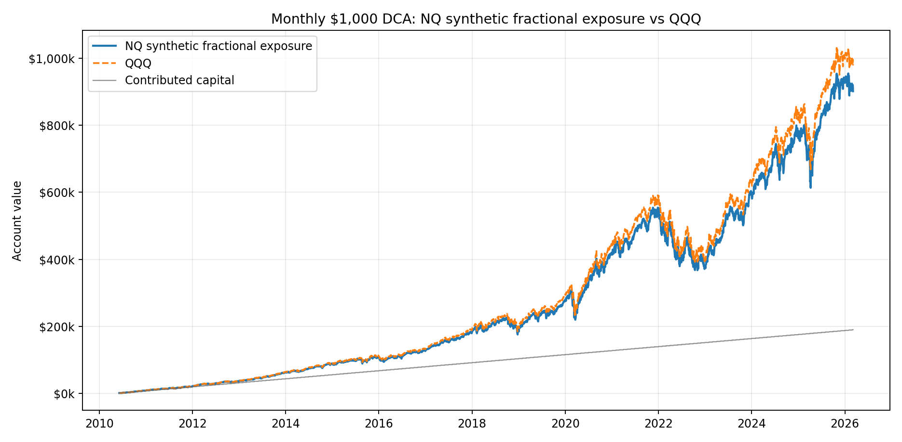
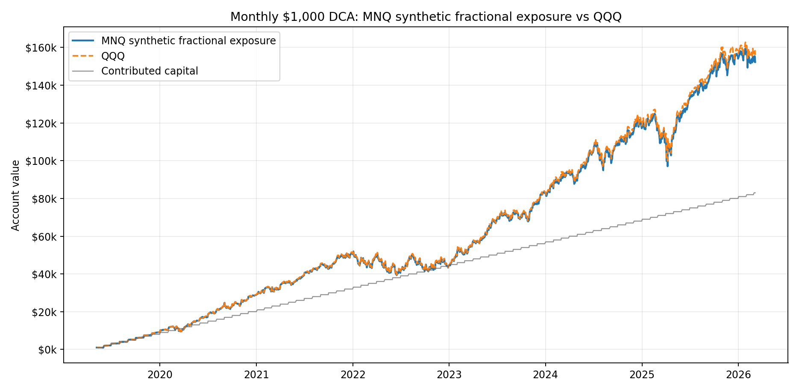
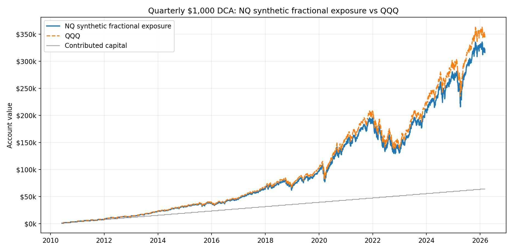
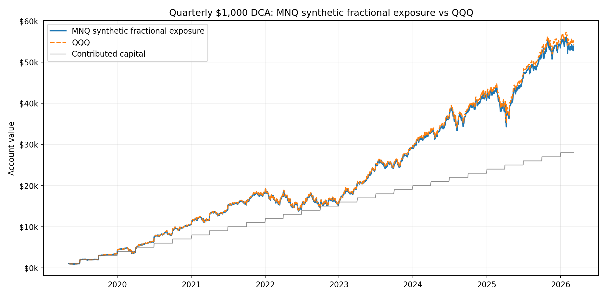

# Futures DCA vs QQQ

Synthetic benchmark: invest **$1,000** on the first common trading day of each calendar month or quarter into the futures close series and into QQQ adjusted close over the exact same dates.

Important caveat: this is **fractional index exposure math**, not an executable NQ/MNQ contract strategy. It ignores futures margin, contract granularity, financing, tax, commissions, slippage, and roll/continuous-contract construction effects. QQQ uses adjusted close, so dividends are included in the ETF benchmark.

| Study | Cadence | Window | Buys | Invested | Futures End | Futures Return | QQQ End | QQQ Return | Fut - QQQ |
| --- | --- | --- | --- | --- | --- | --- | --- | --- | --- |
| NQ synthetic fractional exposure | monthly | 2010-06-07 to 2026-03-06 | 190 | $190,000 | $901,578 | 374.5% | $978,596 | 415.1% | $-77,018 |
| MNQ synthetic fractional exposure | monthly | 2019-05-06 to 2026-03-06 | 83 | $83,000 | $152,271 | 83.5% | $156,084 | 88.1% | $-3,813 |
| NQ synthetic fractional exposure | quarterly | 2010-06-07 to 2026-03-06 | 64 | $64,000 | $316,033 | 393.8% | $343,578 | 436.8% | $-27,545 |
| MNQ synthetic fractional exposure | quarterly | 2019-05-06 to 2026-03-06 | 28 | $28,000 | $52,851 | 88.8% | $54,291 | 93.9% | $-1,441 |

## Charts

## Output Files

- `summary.csv`
- `nq_monthly_dca_vs_qqq_daily.csv`
- `nq_monthly_dca_vs_qqq_buys.csv`
- `nq_quarterly_dca_vs_qqq_daily.csv`
- `nq_quarterly_dca_vs_qqq_buys.csv`
- `mnq_monthly_dca_vs_qqq_daily.csv`
- `mnq_monthly_dca_vs_qqq_buys.csv`
- `mnq_quarterly_dca_vs_qqq_daily.csv`
- `mnq_quarterly_dca_vs_qqq_buys.csv`