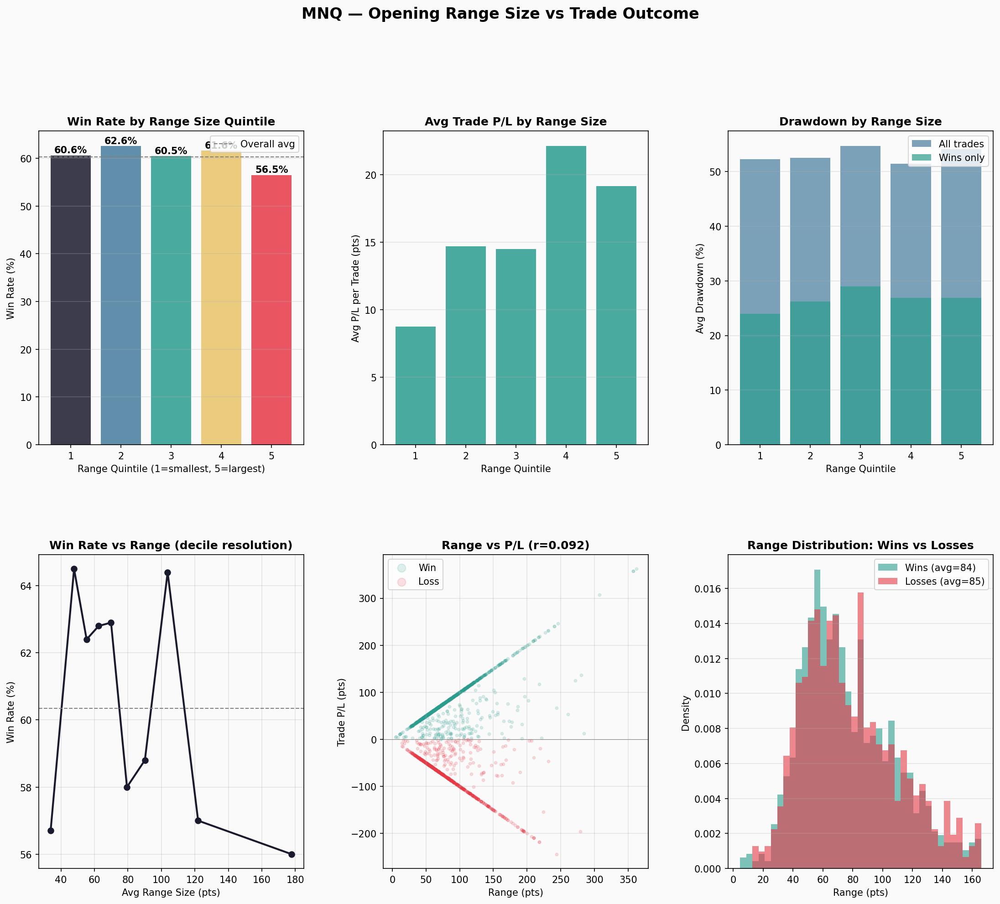
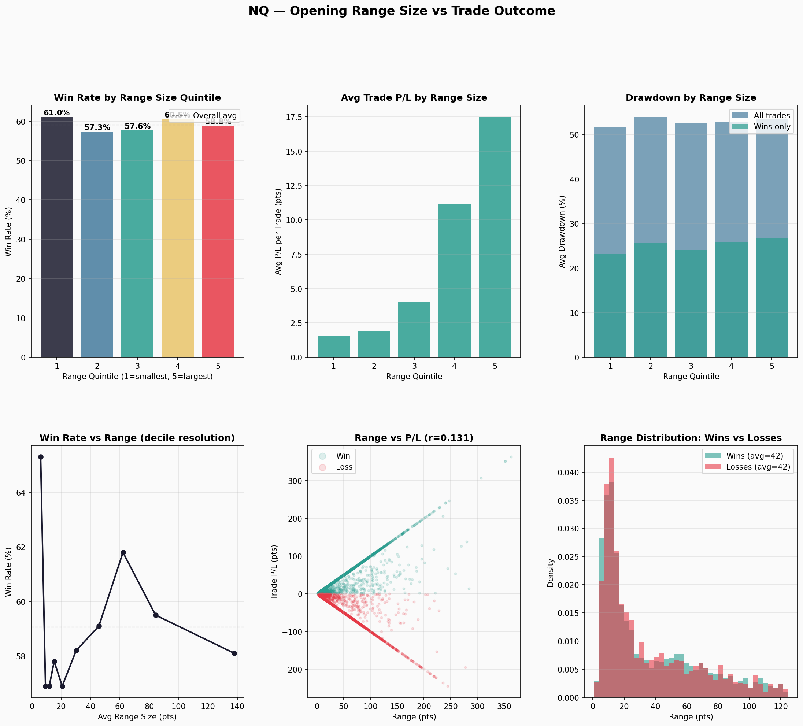

# Range Size vs Trade Outcome

Does a larger opening range (more volatility) predict a higher win rate?

## Short Answer: No.

Range size has **virtually zero correlation with whether a trade wins or loses**.
The edge is consistent regardless of volatility.

## Key Statistics

### Correlations

| Metric | MNQ | NQ (16 yrs) |
|---|---|---|
| Range vs Win (binary) | **-0.014** | **0.001** |
| Range vs Trade P/L | 0.092 | 0.131 |
| Range vs Drawdown % | -0.012 | 0.003 |
| Range vs |P/L| (absolute) | **0.753** | **0.894** |
| Range vs Win DD (wins only) | 0.013 | 0.035 |

The critical number is **Range vs Win (binary)**: -0.014 on MNQ and 0.001 on NQ.
Essentially zero. A bigger range does not make a trade more or less likely to win.

The only strong correlation is Range vs |P/L| (0.75–0.89): larger ranges produce
larger absolute moves in both directions. This is mechanical — the target and stop
are both scaled to the range, so bigger range = bigger win or bigger loss.

### Win Rate by Range Quintile

**MNQ (1,997 trades, 2021–2026):**

| Quintile | Range Band | Trades | Win% | Avg P/L | Avg DD% |
|---|---|---|---|---|---|
| 1 (smallest) | 4–52 pts | 406 | 60.6% | +8.76 | 52.3% |
| 2 | 52–66 pts | 396 | 62.6% | +14.68 | 52.5% |
| 3 | 66–84 pts | 397 | 60.5% | +14.48 | 54.7% |
| 4 | 85–112 pts | 398 | 61.6% | +22.13 | 51.4% |
| 5 (largest) | 112–362 pts | 400 | 56.5% | +19.16 | 54.1% |

**NQ (6,331 trades, 2010–2026):**

| Quintile | Range Band | Trades | Win% | Avg P/L | Avg DD% |
|---|---|---|---|---|---|
| 1 (smallest) | 1–10 pts | 1,301 | 61.0% | +1.57 | 51.6% |
| 2 | 11–17 pts | 1,252 | 57.3% | +1.89 | 53.9% |
| 3 | 18–38 pts | 1,254 | 57.6% | +4.04 | 52.6% |
| 4 | 38–71 pts | 1,267 | 60.5% | +11.16 | 52.9% |
| 5 (largest) | 72–363 pts | 1,257 | 58.8% | +17.48 | 53.4% |

Win rates cluster in a tight 57–63% band across all quintiles. There is no
monotonic trend — larger ranges don't systematically win more or less.

### Average Range: Wins vs Losses

| | MNQ | NQ |
|---|---|---|
| Avg range on Wins | 83.6 pts | 42.2 pts |
| Avg range on Losses | 84.9 pts | 42.2 pts |

Virtually identical. Winning trades and losing trades come from the same
range-size distribution.

### Extremes (Top/Bottom 10%)

| | MNQ Win% | NQ Win% |
|---|---|---|
| Smallest 10% of ranges | 56.7% | 65.3% |
| Largest 10% of ranges | 56.0% | 58.2% |

On NQ, the very smallest ranges actually win *more* often (65.3%). This may be
because tiny ranges occur in calm markets where the breakout is more orderly.
On MNQ, both extremes underperform the average — the "sweet spot" is in
quintiles 2–4.

## Charts

### MNQ Analysis

### NQ Analysis

## Implications

1. **No range-size filter is worth adding.** The win rate is flat across all
   range sizes, so filtering by range would reduce trade count without
   improving edge.

2. **Larger ranges = larger dollar P/L per trade** (both wins and losses).
   This is not a signal — it's just the mechanics of scaling targets/stops
   to the range.

3. **Drawdown is range-independent.** Average drawdown stays ~52–54% across
   all quintiles. The strategy behaves the same in calm and volatile markets.

4. **This is good news.** It means the ORB edge is structural and persistent,
   not dependent on volatility conditions. The strategy doesn't need a
   "volatility filter" to work.

---

## Yearly ORB: Does Breakout Direction Predict Full-Year Return?

For the 3-month opening range (Jan–Mar): when it breaks **bullishly** first, does the year end positive? When it breaks **bearishly** first, does the year end negative?

### Results

| Instrument | Bullish → Year Positive | Bearish → Year Negative | Overall |
|---|---|---|---|
| MNQ | 4/4 (100%) | 1/2 (50%) | 5/6 (83%) |
| NQ | 9/12 (75%) | 1/2 (50%) | 10/14 (71%) |
| ES | 10/13 (77%) | 1/2 (50%) | 11/15 (73%) |
| **Combined** | **23/29 (79%)** | **3/6 (50%)** | **26/35 (74%)** |

### Takeaways

1. **Bullish breakout has predictive value.** When the Jan–Mar range breaks above first, the year ends positive ~79% of the time. That’s a useful directional bias.

2. **Bearish breakout is not reliable.** Only 50% of bearish-breakout years ended negative. Sample size is small (6 bearish years across instruments; 2022 and 2025 are the main ones). 2025 broke bearish but the year ended strongly positive.

3. **Use as a bias filter, not a trade signal.** The yearly breakout can support a bullish tilt for 15-min or monthly ORB trades, but bearish breakout should not be treated as a strong predictor of a down year.

### Script & Data

- `scripts/yearly_breakout_vs_return.py` — computes breakout direction vs year return
- `volatility/yearly_breakout_vs_return.csv` — per-year, per-instrument results

---

## Next Steps

- Add VIX data to test if the *implied* volatility (not range size) has
  any predictive power on trade outcome.
- VIX may capture regime information (fear vs complacency) that the raw
  range size doesn't.

## Files

| File | Description |
|---|---|
| `mnq_range_analysis.png` | 6-panel MNQ analysis chart |
| `nq_range_analysis.png` | 6-panel NQ analysis chart |
| `range_quintile_stats.csv` | Win rate, P/L, DD by range quintile |
| `yearly_breakout_vs_return.csv` | Yearly ORB breakout direction vs full-year return |
| `mnq_decile_stats.csv` | Finer 10-bin breakdown (MNQ) |
| `nq_decile_stats.csv` | Finer 10-bin breakdown (NQ) |
